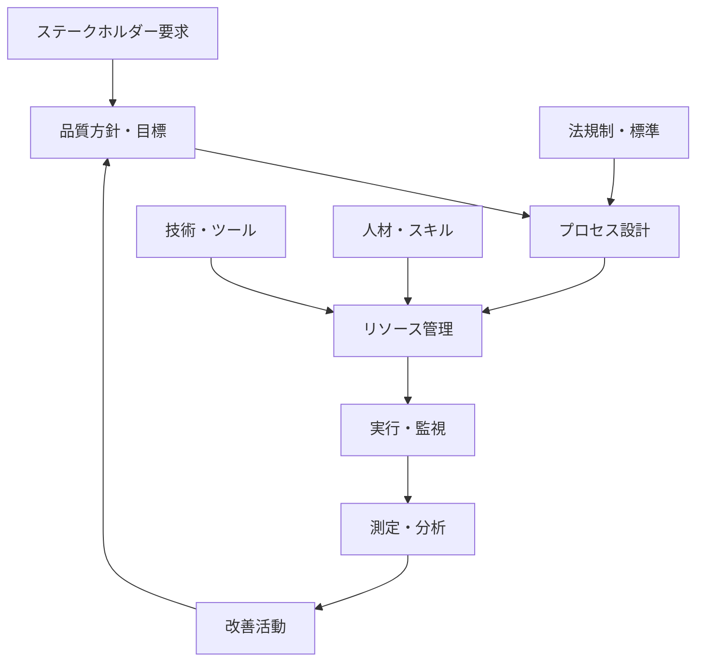
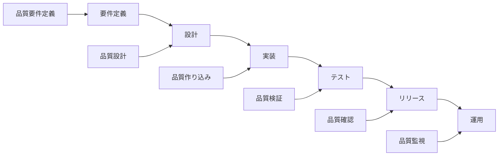

# 📚 第2章: 品質マネジメントとソフトウェアテスト - 理論学習・基本演習

## 🎯 理論学習目標
- 品質マネジメントの基本概念と体系を理解する
- ソフトウェアテストの強み・弱みを品質の観点で分析する
- 品質マネジメントシステムの実装アプローチを習得する

---

## 📖 第1部: 品質マネジメントの基本概念

### 🔍 2.1 ソフトウェアテストの強みを活かし弱みを補う

#### テストの強み
**検証能力**:
- 実装された機能の動作確認
- 欠陥の直接的な検出
- 客観的な証拠の提供

**品質評価**:
- 品質レベルの定量的測定
- リリース判定の根拠提供
- リスク評価の基礎データ

**改善促進**:
- 開発プロセスの問題点発見
- 品質向上のフィードバック
- 継続的改善の起点

#### テストの弱み・限界
**予防能力の限界**:
- 欠陥の事前防止は困難
- 根本原因への直接的アプローチ不足
- プロセス改善への間接的影響

**リソース効率**:
- 後工程での欠陥発見はコスト大
- 全数テストの実現不可能性
- テスト自体の品質確保が必要

**範囲の制約**:
- 非機能要件の評価困難
- 運用・保守品質の限定的評価
- ビジネス要件適合性の間接的確認

### 📊 演習2-1: テストの強み・弱み分析

**課題**: あなたのプロジェクトでのテスト活動を分析してください

```markdown
## プロジェクト情報
- プロジェクト名: [記入]
- 期間・規模: [記入]
- テスト工程: [記入]

## テストの強みの発揮状況
1. **検証能力**:
   - 効果的だった場面: 
   - 具体的成果: 
   
2. **品質評価**:
   - 貢献した判断: 
   - 提供したデータ: 

3. **改善促進**:
   - 発見した問題: 
   - 改善につながった事例: 

## テストの弱みが露呈した場面
1. **予防能力の限界**:
   - 防げなかった問題: 
   - 根本原因: 
   
2. **リソース効率**:
   - 非効率だった活動: 
   - コスト・時間の課題: 

3. **範囲の制約**:
   - カバーしきれなかった領域: 
   - 見逃した品質問題: 

## 改善の方向性
- 強みを更に活かす方法: 
- 弱みを補完する仕組み: 
```

---

## 📖 第2部: 品質マネジメントの体系

### 🏗️ 2.2 品質マネジメントシステム

#### 品質マネジメントの定義
**ISO 9000による定義**:
> 品質に関して組織を指揮し、管理するための調整された活動

**ソフトウェア開発での解釈**:
- **計画**: 品質目標・基準の設定
- **実行**: 品質確保活動の実施
- **監視**: 品質状況のモニタリング
- **改善**: 継続的な品質向上

#### 品質マネジメントシステムの構成要素



### 🎯 2.3 品質マネジメントシステムの実現

#### レイヤー構造での理解

**1. 戦略レイヤー**:
- 品質ビジョン・方針
- 品質目標・KPI
- 品質リスク戦略

**2. プロセスレイヤー**:
- 品質保証プロセス
- 品質管理プロセス
- 改善プロセス

**3. 実行レイヤー**:
- 具体的活動・手順
- ツール・技術
- 測定・評価

**4. 基盤レイヤー**:
- 組織・体制
- 人材・スキル
- 文化・風土

### 📊 演習2-2: 品質マネジメントシステム現状分析

**課題**: 自組織の品質マネジメントシステムを分析してください

```markdown
## 現状分析チェックリスト

### 戦略レイヤー
- [ ] 明文化された品質方針が存在する
- [ ] 測定可能な品質目標が設定されている
- [ ] 品質リスクが特定・評価されている
- **不足している要素**: 

### プロセスレイヤー  
- [ ] 品質保証プロセスが定義されている
- [ ] 品質管理プロセスが運用されている
- [ ] 改善プロセスが機能している
- **不足している要素**: 

### 実行レイヤー
- [ ] 具体的手順・ガイドラインがある
- [ ] 適切なツールが導入されている
- [ ] 定期的な測定・評価が行われている
- **不足している要素**: 

### 基盤レイヤー
- [ ] 品質責任が明確に定義されている
- [ ] 必要なスキルを持つ人材がいる
- [ ] 品質を重視する文化がある
- **不足している要素**: 

## 改善優先度
1. **緊急（3ヶ月以内）**: 
2. **重要（6ヶ月以内）**: 
3. **計画的（1年以内）**: 
```

---

## 📖 第3部: 品質マネジメントの視座でのテスト活用

### 🎯 2.4 品質マネジメントの視座でソフトウェアテストを活用する

#### テストの品質マネジメントへの貢献

**1. 品質情報の提供**:
```
品質測定 → 品質評価 → 意思決定支援
```

**2. 品質リスクの管理**:
```
リスク識別 → リスク評価 → 対策実行 → 効果確認
```

**3. 品質改善の促進**:
```
問題発見 → 原因分析 → 改善実施 → 効果測定
```

#### 統合アプローチの設計

**Phase 1: 計画統合**
- 品質目標とテスト目標の整合
- 品質リスクに基づくテスト戦略
- 品質基準とテスト基準の統一

**Phase 2: 実行統合**
- テスト結果の品質判定への活用
- 品質問題の迅速な対応体制
- 継続的なフィードバックループ

**Phase 3: 改善統合**
- テストから得られた改善提案
- 品質メトリクスによる効果測定
- 次期品質計画への反映

### 📊 演習2-3: テスト・品質統合戦略立案

**課題**: テストと品質マネジメントの統合戦略を立案してください

```markdown
## 統合戦略立案テンプレート

### 現状の課題
1. **テスト側の課題**:
   - 品質目標との不整合: 
   - リソース効率の問題: 
   - 影響範囲の限界: 

2. **品質マネジメント側の課題**:
   - 具体性の不足: 
   - 実行力の限界: 
   - フィードバックの遅れ: 

### 統合アプローチの設計

#### 計画段階の統合
- **品質目標の共有方法**: 
- **リスクベースの優先付け**: 
- **基準・指標の統一**: 

#### 実行段階の統合
- **情報共有の仕組み**: 
- **迅速な対応体制**: 
- **継続的モニタリング**: 

#### 改善段階の統合
- **効果測定の方法**: 
- **改善提案の仕組み**: 
- **次期計画への反映**: 

### 期待効果
- **短期効果（3ヶ月）**: 
- **中期効果（6ヶ月）**: 
- **長期効果（1年）**: 

### 実装計画
| 時期 | 活動 | 責任者 | 成果物 |
|------|------|--------|--------|
| 1ヶ月目 |  |  |  |
| 2ヶ月目 |  |  |  |
| 3ヶ月目 |  |  |  |
```

---

## 📖 第4部: ソフトウェア開発に求められる品質マネジメント

### 🚀 2.5 ソフトウェア開発特有の品質マネジメント

#### ソフトウェアの品質特性

**機能性 (Functionality)**:
- 適合性、正確性、相互運用性
- セキュリティ、準拠性

**信頼性 (Reliability)**:
- 成熟性、障害許容性
- 回復性、可用性

**使用性 (Usability)**:
- 理解性、学習性、操作性
- 魅力性、アクセシビリティ

**効率性 (Efficiency)**:
- 時間効率性、資源効率性
- 容量効率性

**保守性 (Maintainability)**:
- 解析性、変更性、安定性
- 試験性

**移植性 (Portability)**:
- 環境適応性、設置性
- 共存性、置換性

#### 開発ライフサイクルでの品質マネジメント



### 📊 演習2-4: 品質特性別改善計画

**課題**: プロジェクトの品質特性を分析し、改善計画を立案してください

```markdown
## 品質特性別現状評価 (5段階評価)

| 品質特性 | 現状評価 | 主な課題 | 目標レベル | 改善施策 |
|----------|----------|----------|------------|----------|
| 機能性 | /5 |  | /5 |  |
| 信頼性 | /5 |  | /5 |  |
| 使用性 | /5 |  | /5 |  |
| 効率性 | /5 |  | /5 |  |
| 保守性 | /5 |  | /5 |  |
| 移植性 | /5 |  | /5 |  |

## 優先改善領域の選定
1. **最優先（緊急×重要）**: 
2. **高優先（重要）**: 
3. **中優先（緊急）**: 

## 具体的改善計画
### 最優先領域の改善計画
- **対象品質特性**: 
- **現状の具体的問題**: 
- **目標設定**: 
- **改善施策**: 
  1. 
  2. 
  3. 
- **実施スケジュール**: 
- **効果測定方法**: 
```

---

## 🎯 理論学習まとめ

### ✅ 習得すべき重要概念
1. **テストの強み・弱みの正確な理解**
2. **品質マネジメントシステムの体系的理解**
3. **テストと品質マネジメントの統合アプローチ**
4. **ソフトウェア品質特性に基づく品質管理**

### 🔄 次のステップ
理論学習が完了したら、「03_習得レベル確認」で理解度を確認し、理解不足があれば該当部分を復習してから上級演習に進みましょう。

### 📚 参考リソース
- ISO/IEC 25010 (Systems and software Quality Requirements and Evaluation)
- ISO 9001 (Quality management systems)
- PMBOK Guide (Project Management Body of Knowledge)
- ソフトウェアテストの徹底指南書 第2章