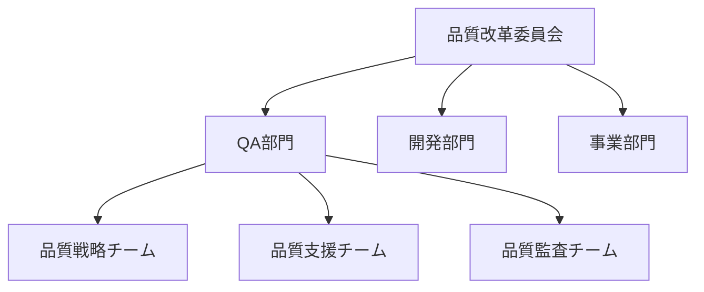
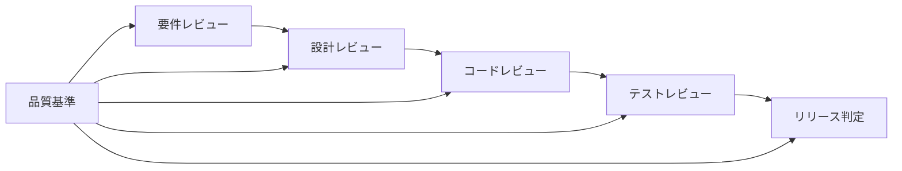
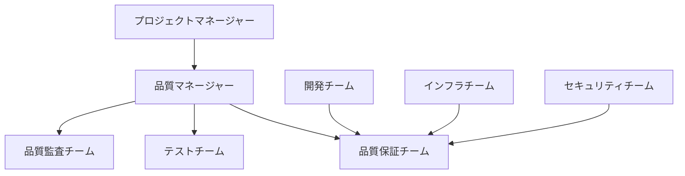

# 🚀 第2章: 品質マネジメントとソフトウェアテスト - 上級演習・実務レベル

## 🎯 上級演習の目標
- 複雑な組織課題に対する品質マネジメント解決策の設計
- 実務レベルでの品質マネジメントシステム構築能力
- ステークホルダー調整を含む実践的な改善推進力

---

## 🏢 演習1: 組織レベル品質課題の解決

### 📋 ケーススタディ: 品質部門の機能不全

**背景情報**:
あなたは大手SIerのQA部門マネージャーに就任しました。以下の状況が判明しています：

**組織状況**:
- 従業員数: 800名、IT部門: 400名、QA部門: 40名
- プロジェクト数: 同時進行15-20件
- 品質部門設立: 5年前、実質的な権限は限定的

**現在の問題**:
1. **品質部門の形骸化**
   - 品質基準の策定はしているが、プロジェクトでの遵守率30%
   - 品質レビューは形式的で、実質的な改善提案なし
   - 現場からは「品質部門は開発の足かせ」との声

2. **プロジェクトレベルの品質問題**
   - 本番障害件数が前年比150%増加
   - 品質問題による納期遅延が頻発
   - 顧客からの品質クレームが増加傾向

3. **組織文化の問題**
   - 「とりあえず動けばOK」の風土
   - 品質よりもスピード・コストを重視
   - 品質活動は「余裕があるときにやるもの」との認識

### 🎯 演習課題1-A: 根本原因分析

**課題**: この品質部門の機能不全について、品質マネジメントの4レイヤー構造で根本原因を分析してください。

```markdown
## 根本原因分析結果

### 戦略レイヤーの問題
#### 品質ビジョン・方針
- **現状**: 
- **問題点**: 
- **根本原因**: 

#### 品質目標・KPI
- **現状**: 
- **問題点**: 
- **根本原因**: 

### プロセスレイヤーの問題
#### 品質保証プロセス
- **現状**: 
- **問題点**: 
- **根本原因**: 

#### 品質管理プロセス
- **現状**: 
- **問題点**: 
- **根本原因**: 

### 実行レイヤーの問題
#### 具体的活動・手順
- **現状**: 
- **問題点**: 
- **根本原因**: 

#### ツール・技術
- **現状**: 
- **問題点**: 
- **根本原因**: 

### 基盤レイヤーの問題
#### 組織・体制
- **現状**: 
- **問題点**: 
- **根本原因**: 

#### 人材・スキル
- **現状**: 
- **問題点**: 
- **根本原因**: 

#### 文化・風土
- **現状**: 
- **問題点**: 
- **根本原因**: 
```

### 🎯 演習課題1-B: 品質マネジメント改革計画

**課題**: 3年間での品質部門改革・品質マネジメントシステム構築計画を立案してください。

```markdown
## 品質マネジメント改革計画

### 改革ビジョン（3年後の目指す姿）
- **品質部門の役割**: 
- **組織文化**: 
- **品質成果**: 
- **ビジネス貢献**: 

### Year 1: 基盤構築フェーズ

#### 第1四半期: 緊急課題対応
**目標**: 
**主要活動**:
1. 
2. 
3. 
**成果物**: 
**リスク・対策**: 

#### 第2四半期: 戦略策定
**目標**: 
**主要活動**:
1. 
2. 
3. 
**成果物**: 
**リスク・対策**: 

#### 第3四半期: プロセス設計
**目標**: 
**主要活動**:
1. 
2. 
3. 
**成果物**: 
**リスク・対策**: 

#### 第4四半期: パイロット実行
**目標**: 
**主要活動**:
1. 
2. 
3. 
**成果物**: 
**リスク・対策**: 

### Year 2: 本格展開フェーズ

#### 主要目標
- 
- 
- 

#### 重点活動
1. **プロセス全面展開**:
   - 
2. **組織体制強化**:
   - 
3. **文化変革推進**:
   - 

#### 成功指標
- **プロセス指標**: 
- **品質指標**: 
- **ビジネス指標**: 

### Year 3: 最適化・定着フェーズ

#### 主要目標
- 
- 
- 

#### 重点活動
1. **継続的改善**:
   - 
2. **高度化・自動化**:
   - 
3. **外部連携・標準化**:
   - 

### 実行体制・リソース計画

#### 推進体制


#### 必要リソース
| 項目 | Year1 | Year2 | Year3 | 備考 |
|------|-------|-------|-------|------|
| 人員 |  |  |  |  |
| 予算 |  |  |  |  |
| ツール |  |  |  |  |
| 教育 |  |  |  |  |

### 変革管理・コミュニケーション戦略

#### ステークホルダー分析
| ステークホルダー | 影響度 | 関心度 | アプローチ戦略 |
|------------------|--------|--------|----------------|
| 経営層 |  |  |  |
| 事業部門長 |  |  |  |
| 開発マネージャー |  |  |  |
| 現場エンジニア |  |  |  |
| 顧客 |  |  |  |

#### コミュニケーション計画
1. **経営報告**:
   - 頻度: 
   - 内容: 
   - 方法: 

2. **現場コミュニケーション**:
   - 頻度: 
   - 内容: 
   - 方法: 

3. **成果共有**:
   - 頻度: 
   - 内容: 
   - 方法: 
```

---

## 🚀 演習2: プロジェクトレベル品質マネジメント実装

### 📋 ケーススタディ: 大規模Webシステム開発

**プロジェクト概要**:
- **システム**: 金融機関向け新ネットバンキングシステム
- **規模**: 開発期間18ヶ月、チーム規模80名、予算15億円
- **技術**: マイクロサービスアーキテクチャ、AWS、React、Spring Boot
- **品質要件**: 99.9%可用性、レスポンス2秒以内、セキュリティレベルAA

**プロジェクト状況**:
- 開始から6ヶ月経過、全体進捗40%
- 要件変更が頻発（累計150件）
- 技術的な課題が多発（性能、セキュリティ）
- チーム間の連携に課題あり

### 🎯 演習課題2-A: 品質マネジメント計画策定

**課題**: このプロジェクトの品質マネジメント計画を策定してください。

```markdown
## プロジェクト品質マネジメント計画

### 品質方針・目標
#### 品質方針
- **顧客価値**: 
- **品質基準**: 
- **改善姿勢**: 

#### 品質目標（定量的）
| 品質特性 | 目標値 | 測定方法 | 責任者 |
|----------|--------|----------|--------|
| 機能性 |  |  |  |
| 信頼性 |  |  |  |
| 使用性 |  |  |  |
| 効率性 |  |  |  |
| 保守性 |  |  |  |
| セキュリティ |  |  |  |

### 品質プロセス設計

#### 品質保証プロセス


1. **要件品質保証**:
   - 実施内容: 
   - 品質基準: 
   - 実施タイミング: 

2. **設計品質保証**:
   - 実施内容: 
   - 品質基準: 
   - 実施タイミング: 

3. **実装品質保証**:
   - 実施内容: 
   - 品質基準: 
   - 実施タイミング: 

#### 品質管理プロセス
1. **品質測定**:
   - 測定項目: 
   - 測定頻度: 
   - 責任者: 

2. **品質監視**:
   - 監視項目: 
   - 監視方法: 
   - エスカレーション基準: 

3. **品質改善**:
   - 改善トリガー: 
   - 改善プロセス: 
   - 効果測定: 

### テスト戦略との統合

#### リスクベーステスト戦略
**高リスク領域**:
1. **セキュリティ機能**:
   - リスク内容: 
   - テスト戦略: 
   - 品質基準: 

2. **性能要件**:
   - リスク内容: 
   - テスト戦略: 
   - 品質基準: 

3. **データ整合性**:
   - リスク内容: 
   - テスト戦略: 
   - 品質基準: 

#### テストレベル別品質管理
| テストレベル | 品質目標 | 測定指標 | 合格基準 |
|--------------|----------|----------|----------|
| 単体テスト |  |  |  |
| 統合テスト |  |  |  |
| システムテスト |  |  |  |
| 受入テスト |  |  |  |

### 品質組織・体制

#### 品質責任体制


#### 役割・責任
| 役割 | 責任範囲 | 担当者 | 権限 |
|------|----------|--------|------|
| 品質マネージャー |  |  |  |
| 品質保証リーダー |  |  |  |
| テストリーダー |  |  |  |
| 品質監査担当 |  |  |  |

### 品質リスク管理

#### 品質リスク一覧
| リスク項目 | 発生確率 | 影響度 | リスクレベル | 対策 |
|------------|----------|--------|--------------|------|
| 要件品質不備 |  |  |  |  |
| 設計品質問題 |  |  |  |  |
| 実装品質問題 |  |  |  |  |
| テスト品質不足 |  |  |  |  |
| 統合品質問題 |  |  |  |  |

#### リスク対応戦略
1. **予防策**:
   - 
2. **検出策**:
   - 
3. **対応策**:
   - 
4. **継続監視**:
   - 
```

### 🎯 演習課題2-B: 品質問題対応シナリオ

**課題**: 以下の品質問題が発生した場合の対応計画を立案してください。

**シナリオ**: プロジェクト12ヶ月時点で以下の問題が発覚
- システムテストで性能要件未達（応答時間5秒）
- セキュリティテストで脆弱性20件発見
- 統合テストで他システム連携部分の不具合100件
- 本番環境での性能劣化（開発環境の1/3）

```markdown
## 品質問題対応計画

### 緊急対応（1週間以内）
#### 影響分析
- **スケジュール影響**: 
- **品質影響**: 
- **コスト影響**: 
- **リスク影響**: 

#### 即座の対応策
1. **クリティカル問題への対応**:
   - 
2. **ステークホルダー報告**:
   - 
3. **追加リソース確保**:
   - 

### 短期対応（1ヶ月以内）
#### 根本原因分析
1. **性能問題の原因**:
   - 技術的原因: 
   - プロセス的原因: 
   - 組織的原因: 

2. **セキュリティ問題の原因**:
   - 技術的原因: 
   - プロセス的原因: 
   - 組織的原因: 

3. **統合問題の原因**:
   - 技術的原因: 
   - プロセス的原因: 
   - 組織的原因: 

#### 解決策実行計画
| 問題領域 | 解決策 | 担当 | 期限 | 成功基準 |
|----------|--------|------|------|----------|
| 性能 |  |  |  |  |
| セキュリティ |  |  |  |  |
| 統合 |  |  |  |  |
| 環境 |  |  |  |  |

### 中長期対応（3ヶ月以内）
#### プロセス改善
1. **品質保証プロセス強化**:
   - 
2. **テストプロセス改善**:
   - 
3. **リスク管理強化**:
   - 

#### 組織・体制強化
1. **スキル強化**:
   - 
2. **体制見直し**:
   - 
3. **ツール・環境改善**:
   - 

### 再発防止策
#### システム的対策
- 
#### プロセス的対策
- 
#### 人的対策
- 

### 効果測定・継続改善
#### 効果測定指標
- 短期指標: 
- 中期指標: 
- 長期指標: 

#### 継続改善計画
- 
```

---

## 🎯 上級演習まとめ

### ✅ 習得すべき上級スキル
1. **組織レベルの品質課題解決能力**
2. **プロジェクトレベルの品質マネジメント設計能力**
3. **複雑な品質問題への総合的対応能力**
4. **ステークホルダー調整・変革推進能力**

### 🔄 実務適用への準備
上級演習完了後は、以下を実施して実務適用の準備を整えましょう：

1. **自組織での適用可能性検討**
2. **具体的な実装計画の立案**
3. **関係者との調整準備**
4. **効果測定方法の設計**

### 📚 次のステップ
「05_追加演習・補強練習」で理解不足分野を補強するか、「06_実務適用ガイド」で実際の適用方法を学習しましょう。