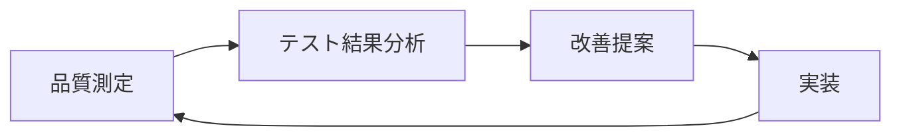

# 🔄 第2章: 品質マネジメントとソフトウェアテスト - 追加演習・補強練習

## 🎯 補強練習の目的
- 理解不足分野の集中的な強化
- 多様なケースでの応用力向上
- 実務適用前の最終確認

---

## 📊 理解度別補強練習メニュー

### 🔍 分野別自己診断

各分野について、理解度を1-5で自己評価してください（5が最高）：

```markdown
## 理解度自己診断

| 分野 | 理解度(/5) | 補強の必要性 |
|------|------------|--------------|
| 品質マネジメント基本概念 |  | 高/中/低 |
| テストの強み・弱み分析 |  | 高/中/低 |
| 品質マネジメントシステム |  | 高/中/低 |
| 統合的アプローチ設計 |  | 高/中/低 |
| 組織課題解決 |  | 高/中/低 |
| プロジェクト適用 |  | 高/中/低 |
| 問題対応・改善 |  | 高/中/低 |

## 優先補強領域
1. **最優先**: 
2. **高優先**: 
3. **中優先**: 
```

---

## 🏗️ 補強練習A: 品質マネジメント基本概念

### 🎯 対象者
- 基本概念の理解度が3以下の学習者
- 用語・定義があいまいな学習者

### 📝 練習A-1: 概念整理マトリックス

**課題**: 以下のマトリックスを完成させてください。

```markdown
## 品質マネジメント概念マトリックス

| 概念 | 定義 | 目的 | 具体例 | 測定方法 |
|------|------|------|--------|----------|
| 品質 |  |  |  |  |
| 品質保証 |  |  |  |  |
| 品質管理 |  |  |  |  |
| 品質計画 |  |  |  |  |
| 品質改善 |  |  |  |  |
| 品質監査 |  |  |  |  |
| 品質システム |  |  |  |  |
```

### 📝 練習A-2: 関係性図解

**課題**: 品質関連概念の関係性を図解してください。

```markdown
## 概念関係図

品質、品質管理、品質保証、テスト、検証、妥当性確認の関係を
図解し、それぞれの関係性を説明してください。

### 図解エリア
（手書きまたはツールで作成）

### 関係性説明
1. 品質と品質管理の関係:
   
2. 品質保証とテストの関係:
   
3. 検証と妥当性確認の関係:
   
4. 全体システムとしての関係:
   
```

### 📝 練習A-3: 業界別品質要件

**課題**: 異なる業界での品質要件を比較分析してください。

```markdown
## 業界別品質要件分析

### 金融業界
**重要な品質特性**:
1. 
2. 
3. 
**特有の品質要件**:
- 
**品質マネジメントの特徴**:
- 

### 医療業界  
**重要な品質特性**:
1. 
2. 
3. 
**特有の品質要件**:
- 
**品質マネジメントの特徴**:
- 

### Eコマース業界
**重要な品質特性**:
1. 
2. 
3. 
**特有の品質要件**:
- 
**品質マネジメントの特徴**:
- 

### 共通要素と差異
**共通要素**:
- 
**主な差異**:
- 
**学習ポイント**:
- 
```

---

## 🔗 補強練習B: テスト・品質マネジメント統合

### 🎯 対象者
- 統合的アプローチの理解度が3以下の学習者
- テストと品質管理を別々に考える傾向がある学習者

### 📝 練習B-1: 統合シナリオ設計

**課題**: 以下のプロジェクトで統合アプローチを設計してください。

**プロジェクト**: IoTデバイス管理システム開発
- デバイス台数: 100万台想定
- リアルタイム性要件: 1秒以内
- セキュリティ: 暗号化通信必須
- 可用性: 99.99%

```markdown
## 統合アプローチ設計

### Phase1: 計画統合
#### 品質目標の設定
- **機能品質目標**: 
- **非機能品質目標**: 
- **ビジネス品質目標**: 

#### テスト戦略との整合
- **テスト目標**: 
- **品質目標との整合点**: 
- **優先順位付けの基準**: 

### Phase2: 実行統合
#### 情報共有の仕組み
- **品質データ → テスト**: 
- **テスト結果 → 品質判定**: 
- **共有頻度・方法**: 

#### 迅速な対応体制
- **品質問題検出時**: 
- **テスト遅延時**: 
- **要件変更時**: 

### Phase3: 改善統合
#### 継続的改善サイクル


#### 効果測定
- **統合効果の指標**: 
- **測定方法**: 
- **改善の判断基準**: 
```

### 📝 練習B-2: 課題解決統合演習

**課題**: 以下の課題に対し、テストと品質管理の統合で解決策を提案してください。

**課題状況**:
- 開発完了後のテスト工程で多数の品質問題が発覚
- 修正作業により開発チームとテストチームの関係が悪化
- ステークホルダーから品質向上とスピードアップの両方を要求

```markdown
## 統合解決策

### 現状分析
#### 問題の構造
- **表面的な問題**: 
- **深層的な問題**: 
- **根本原因**: 

#### ステークホルダー影響
- **開発チーム**: 
- **テストチーム**: 
- **ビジネス側**: 

### 統合解決アプローチ
#### 短期解決策（1ヶ月）
1. **関係修復**:
   - 
2. **品質・テスト統合**:
   - 
3. **迅速な改善**:
   - 

#### 中期解決策（3ヶ月）
1. **プロセス統合**:
   - 
2. **組織・体制統合**:
   - 
3. **ツール・情報統合**:
   - 

#### 長期解決策（6ヶ月）
1. **文化・風土統合**:
   - 
2. **継続改善統合**:
   - 
3. **イノベーション創出**:
   - 

### 期待効果
- **品質向上**: 
- **スピードアップ**: 
- **関係改善**: 
- **ビジネス貢献**: 
```

---

## 🏢 補強練習C: 組織課題解決

### 🎯 対象者
- 組織レベルの課題解決が苦手な学習者
- 変革推進の経験が少ない学習者

### 📝 練習C-1: 抵抗要因分析・対策

**課題**: 品質改善に対する組織の抵抗要因を分析し、対策を立案してください。

```markdown
## 抵抗要因分析・対策

### 抵抗要因の特定
#### 個人レベルの抵抗
| 抵抗要因 | 具体的な行動・発言 | 背景・原因 | 対策案 |
|----------|-------------------|------------|-------|
| スキル不足 |  |  |  |
| 時間不足 |  |  |  |
| 意識不足 |  |  |  |
| 変化への恐れ |  |  |  |

#### 組織レベルの抵抗
| 抵抗要因 | 具体的な現象 | 背景・原因 | 対策案 |
|----------|--------------|------------|-------|
| 文化・風土 |  |  |  |
| 既存プロセス |  |  |  |
| リソース制約 |  |  |  |
| 政治的要因 |  |  |  |

### 対策戦略
#### コミュニケーション戦略
1. **経営層への働きかけ**:
   - メッセージ: 
   - 方法: 
   - タイミング: 

2. **現場への働きかけ**:
   - メッセージ: 
   - 方法: 
   - タイミング: 

#### 段階的導入戦略
1. **パイロット実施**:
   - 対象: 
   - 期間: 
   - 成功指標: 

2. **段階的拡大**:
   - 展開順序: 
   - 各段階の期間: 
   - リスク軽減策: 

### 成功要因
- **リーダーシップ**: 
- **コミュニケーション**: 
- **実績・成果**: 
- **継続性**: 
```

### 📝 練習C-2: 変革ロードマップ作成

**課題**: 以下の組織状況から、3年間の品質改革ロードマップを作成してください。

**組織状況**:
- 従業員数300名のソフトウェア開発会社
- 品質への意識低く、「動けばOK」の文化
- 顧客からの品質クレーム増加
- 新規事業参入のため品質向上が急務

```markdown
## 品質改革ロードマップ

### 現状分析・課題特定
#### SWOT分析
**Strengths（強み）**:
- 
**Weaknesses（弱み）**:
- 
**Opportunities（機会）**:
- 
**Threats（脅威）**:
- 

### 改革ビジョン・目標
#### 3年後のビジョン
- 
#### 定量目標
- 顧客満足度: 現状 → 目標
- 品質コスト: 現状 → 目標  
- 開発効率: 現状 → 目標
- 従業員満足度: 現状 → 目標

### 年次計画
#### Year 1: 基盤づくり
**四半期別計画**:

Q1:
- 目標: 
- 主要活動: 
- 成果物: 

Q2:
- 目標: 
- 主要活動: 
- 成果物: 

Q3:
- 目標: 
- 主要活動: 
- 成果物: 

Q4:
- 目標: 
- 主要活動: 
- 成果物: 

#### Year 2: 本格展開
**主要目標**:
- 
**重点活動**:
1. 
2. 
3. 

#### Year 3: 定着・発展
**主要目標**:
- 
**重点活動**:
1. 
2. 
3. 

### リスク管理
| リスク | 発生確率 | 影響度 | 対策 |
|--------|----------|--------|------|
|  |  |  |  |
|  |  |  |  |
|  |  |  |  |

### 成功指標・測定方法
#### プロセス指標
- 
#### 結果指標
- 
#### 先行指標
- 
```

---

## 🚀 補強練習D: 実践力向上

### 🎯 対象者
- すべての学習者（最終確認）
- 実務適用前の総合力チェック

### 📝 練習D-1: 総合ケーススタディ

**課題**: 以下の複合的な課題に対し、品質マネジメントの知識を総動員して解決策を提案してください。

**複合課題**:
スタートアップ企業が急成長中。以下の課題が同時発生：
1. 開発スピード優先で品質がおろそかに
2. エンジニア急増により品質レベルがばらつき
3. 顧客からの品質要求レベルが向上
4. 競合他社の品質レベルが高く、差別化困難
5. IPO準備のため、品質ガバナンス強化が必要

```markdown
## 総合解決策提案

### 課題の優先順位付け
#### 緊急性・重要性マトリックス
```
高重要 |     |     |
      |  Q2 |  Q1 |
      |     |     |
------|-----|-----|
      |     |     |
      |  Q3 |  Q4 |
低重要 |     |     |
      低緊急  高緊急
```

各課題の配置:
- 課題1: 
- 課題2: 
- 課題3: 
- 課題4: 
- 課題5: 

#### 解決順序
1. 
2. 
3. 
4. 
5. 

### 統合解決戦略
#### 短期戦略（3ヶ月）
**目標**: 
**主要施策**:
1. 
2. 
3. 
**期待効果**: 

#### 中期戦略（6ヶ月）
**目標**: 
**主要施策**:
1. 
2. 
3. 
**期待効果**: 

#### 長期戦略（1年）
**目標**: 
**主要施策**:
1. 
2. 
3. 
**期待効果**: 

### 実行計画
#### 推進体制
- 
#### 必要リソース
- 人員: 
- 予算: 
- ツール: 
- 時間: 

#### 成功指標
- 
#### リスク対策
- 

### IPO対応
#### ガバナンス要件
- 
#### 対応策
- 
#### スケジュール
- 
```

---

## 🎯 補強練習完了チェック

### ✅ 最終確認チェックリスト

以下のすべてにチェックが入れば、実務適用の準備完了です：

#### 知識・理解
- [ ] 品質マネジメントの基本概念を正確に説明できる
- [ ] テストと品質管理の関係性を整理できる
- [ ] 品質マネジメントシステムの設計ができる
- [ ] 業界特性を考慮した品質要件を定義できる

#### 分析・解決能力
- [ ] 組織の品質課題を体系的に分析できる
- [ ] 複合的な問題に対し統合的解決策を提案できる
- [ ] ステークホルダーの抵抗要因を分析・対策できる
- [ ] 変革推進のロードマップを作成できる

#### 実践・応用能力
- [ ] 自組織の現状を客観的に評価できる
- [ ] 実現可能な改善計画を立案できる
- [ ] リスクを考慮した実行戦略を設計できる
- [ ] 効果測定・継続改善の仕組みを構築できる

### 🔄 不足分野の追加学習

チェックが入らない項目については、以下で追加学習してください：

**基本概念不足** → 練習A を重点的に実施
**統合思考不足** → 練習B を重点的に実施  
**組織課題解決不足** → 練習C を重点的に実施
**総合力不足** → 練習D を繰り返し実施

### 🚀 実務適用への移行

すべてのチェックが完了したら、「06_実務適用ガイド」で実際の適用方法を学習し、現実のプロジェクトでの実践に移りましょう！