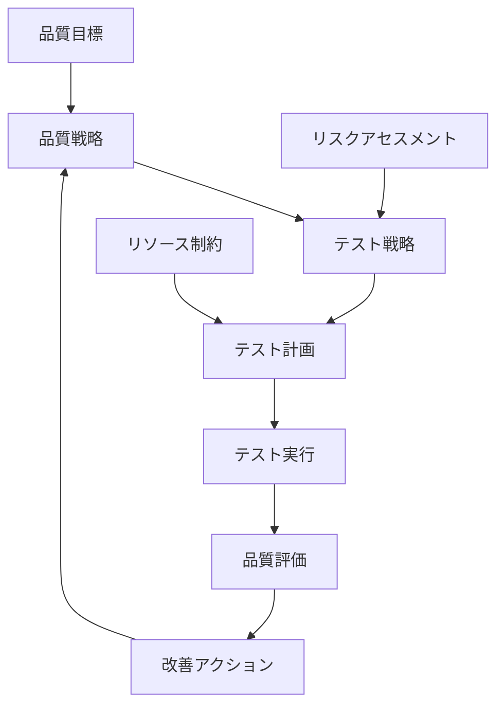

# 🚀 第2章: 品質マネジメントとソフトウェアテスト - 実務適用ガイド

## 🎯 実務適用の目標
- 学習内容を実際のプロジェクト・組織で活用する
- 他のテスト技法・手法との効果的な組み合わせ
- 継続的な品質改善システムの構築・運用

---

## 🔗 第1部: 他章・技法との連携

### 📚 Part I（基礎）との連携

#### 第1章「ソフトウェアテストとは」との連携
**統合ポイント**:
- テストの目的・原則 → 品質目標への反映
- テストレベル → 品質保証活動との整合
- テストプロセス → 品質マネジメントプロセスとの統合

**実践的統合例**:
```markdown
## テスト原則と品質方針の統合

### 7つのテスト原則の品質マネジメントへの活用
1. **欠陥の偏在**:
   - 品質リスク分析での重点領域特定
   - リソース配分の最適化基準

2. **全数テストの不可能性**:
   - 品質目標に基づくテスト優先順位設定
   - リスクベース品質管理戦略

3. **早期テストの重要性**:
   - シフトレフト品質保証アプローチ
   - 予防的品質管理活動の強化

### 実装方法
- 品質方針にテスト原則を明記
- 品質目標設定時にテスト制約を考慮
- 品質計画とテスト計画の同期実施
```

#### 第3章「ソフトウェアテストの全体像」との連携
**統合ポイント**:
- テスト構成要素 → 品質システム構成要素との対応
- テスト概念・用語 → 品質概念・用語との統一
- テスト戦略 → 品質戦略との整合

### 📊 Part II（戦略・プロセス）との連携

#### テスト戦略との統合
**統合フレームワーク**:


**具体的統合方法**:
1. **シフトレフトテスト戦略と予防的品質管理**
2. **アジャイルテスト戦略と反復的品質改善**
3. **DevOpsテスト戦略と継続的品質監視**

### 🛠️ Part III（作成・実行）との連携

#### テスト技法と品質測定の統合
**同値分割法 × 品質管理**:
- 品質要件の同値クラス分析
- 品質指標の分類・優先順位付け

**境界値分析 × 品質監視**:
- 品質閾値の設定・監視
- 品質劣化の早期検出

**デシジョンテーブル × 品質判定**:
- 複雑な品質判定基準の整理
- 品質ゲート通過条件の明確化

---

## 🏢 第2部: 組織レベル実装戦略

### 🎯 実装パターン別アプローチ

#### パターンA: 新規組織・プロジェクト
**特徴**: 
- 既存制約が少ない
- 一から体系構築可能
- 変革抵抗が相対的に小さい

**実装戦略**:
```markdown
## 新規組織での実装計画

### Phase 1: 基盤設計（1-2ヶ月）
1. **品質ビジョン・方針策定**
   - ステークホルダーワークショップ
   - 品質価値観の共有
   - 品質方針の文書化

2. **品質マネジメントシステム設計**
   - 組織構造に適合したプロセス設計
   - 役割・責任の明確化
   - 測定・評価指標の設定

3. **初期ツール・環境整備**
   - 品質管理ツールの選定・導入
   - 測定・監視環境の構築
   - 報告・コミュニケーション基盤

### Phase 2: パイロット実行（2-3ヶ月）
1. **小規模プロジェクトでの試行**
2. **フィードバック収集・改善**
3. **成功事例の創出・共有**

### Phase 3: 本格展開（3-6ヶ月）
1. **全組織への展開**
2. **継続改善サイクルの確立**
3. **成熟度向上活動**
```

#### パターンB: 既存組織の改革
**特徴**:
- 既存プロセス・文化の制約
- 変革抵抗への対応必要
- 段階的・戦略的アプローチが重要

**実装戦略**:
```markdown
## 既存組織での改革計画

### Step 1: 現状分析・課題特定（1ヶ月）
1. **品質成熟度評価**
   - 現状のプロセス・体制評価
   - 品質問題の根本原因分析
   - ステークホルダーニーズ調査

2. **変革準備度評価**
   - 組織文化・風土の分析
   - 変革推進力・抵抗要因の特定
   - リーダーシップ・支援体制の評価

### Step 2: 変革戦略立案（1ヶ月）
1. **段階的改革計画**
   - 緊急課題の優先対応
   - 中長期ビジョンの設定
   - マイルストーン・成功指標の定義

2. **変革推進体制**
   - チェンジエージェントの特定・育成
   - コミュニケーション戦略
   - リスク軽減策

### Step 3: 段階的実行（6-12ヶ月）
1. **クイックウィンの創出**
2. **パイロット部門での成功事例**
3. **全社展開・定着化**
```

#### パターンC: プロジェクト単位での適用
**特徴**:
- 限定的な範囲での実装
- 短期間での効果実現が期待
- 他プロジェクトへの波及効果を狙う

**実装戦略**:
```markdown
## プロジェクト単位での実装

### 準備フェーズ（2週間）
1. **プロジェクト品質目標設定**
   - ビジネス要件からの品質目標導出
   - 測定可能な品質指標の定義
   - ステークホルダー合意形成

2. **品質マネジメント計画**
   - プロジェクト規模に適したプロセス設計
   - 役割・責任の明確化
   - テスト計画との統合

### 実行フェーズ（プロジェクト期間全体）
1. **継続的品質監視**
   - 品質指標の定期測定
   - 品質問題の早期検出・対応
   - ステークホルダーへの定期報告

2. **品質改善活動**
   - レトロスペクティブでの改善識別
   - プロセス改善の実装
   - 学習・ナレッジ共有

### 振り返りフェーズ（1週間）
1. **効果測定・評価**
2. **学習内容の体系化**
3. **次プロジェクトへの展開準備**
```

---

## 🔄 第3部: 継続的改善システム

### 📊 品質改善のPDCAサイクル

#### Plan（計画）
**品質改善計画の立案**:
```markdown
## 品質改善計画テンプレート

### 改善目標設定
- **現状の課題**: 
- **改善目標（定量）**: 
- **改善目標（定性）**: 
- **目標達成期限**: 

### 根本原因分析
- **表面的な問題**: 
- **深層的な原因**: 
- **システム的な要因**: 

### 改善策の設計
- **短期施策**: 
- **中期施策**: 
- **長期施策**: 

### 実行計画
| 施策 | 担当者 | 期限 | 成功指標 | リスク |
|------|--------|------|----------|--------|
|  |  |  |  |  |

### リソース計画
- **人員**: 
- **予算**: 
- **ツール**: 
- **時間**: 
```

#### Do（実行）
**改善活動の実施管理**:
```markdown
## 改善活動実施ガイド

### 実施体制
- **改善リーダー**: 役割・権限
- **実行チーム**: メンバー・役割分担
- **支援体制**: 経営支援・技術支援

### 実施管理
1. **進捗管理**:
   - 週次進捗レビュー
   - マイルストーン管理
   - 課題・リスク管理

2. **品質管理**:
   - 改善活動自体の品質確保
   - 変更管理・影響分析
   - ステークホルダーコミュニケーション

3. **学習促進**:
   - 実施過程での学習捕捉
   - ナレッジの体系化
   - チーム学習の促進
```

#### Check（評価）
**改善効果の測定・評価**:
```markdown
## 改善効果評価フレームワーク

### 定量評価
#### プロセス指標
- **効率性**: 作業時間、コスト削減
- **品質**: 欠陥密度、再作業率
- **スピード**: リードタイム、サイクルタイム

#### 結果指標
- **顧客満足**: 顧客満足度、クレーム件数
- **ビジネス**: 売上、利益、市場シェア
- **組織**: 従業員満足度、離職率

### 定性評価
#### ステークホルダー評価
- **顧客**: インタビュー、アンケート
- **従業員**: 満足度調査、フォーカスグループ
- **経営**: 戦略目標への貢献度

#### プロセス評価
- **成熟度**: プロセス成熟度モデル
- **文化**: 品質文化の浸透度
- **学習**: 組織学習能力の向上

### 評価結果の分析
1. **目標達成度評価**:
   - 設定目標との比較
   - 未達成要因の分析
   - 予想外の効果の識別

2. **ROI分析**:
   - 投資対効果の算出
   - コストベネフィット分析
   - 長期的影響の評価

3. **学習抽出**:
   - 成功要因の特定
   - 失敗要因の分析
   - 再現可能な知識の抽出
```

#### Action（改善）
**評価結果に基づく次期改善**:
```markdown
## 次期改善計画

### 評価結果の活用
1. **成功事例の標準化**:
   - ベストプラクティスの文書化
   - 他部門・プロジェクトへの展開
   - 組織標準への反映

2. **未達成要因への対応**:
   - 根本原因の再分析
   - 追加改善策の立案
   - リソース・体制の見直し

3. **新たな改善機会の識別**:
   - 改善過程で発見された課題
   - ステークホルダーからの新要求
   - 外部環境変化への対応

### 継続的改善の仕組み化
1. **改善文化の醸成**:
   - 改善活動の評価・表彰
   - 改善アイデアの募集・実現
   - 失敗を学習機会とする風土

2. **改善能力の向上**:
   - 改善手法の教育・訓練
   - 改善リーダーの育成
   - 外部ベンチマーク・学習

3. **システム的改善**:
   - 改善プロセスの改善
   - 改善ツールの高度化
   - 改善効果の予測・計画
```

---

## 🎯 第4部: 成功事例・失敗事例から学ぶ

### ✅ 成功事例パターン

#### パターン1: 経営コミット型成功
**事例概要**:
- 企業: 中堅SIer（従業員500名）
- 課題: 品質問題による事業リスク増大
- アプローチ: 経営主導の品質改革

**成功要因**:
```markdown
## 成功要因分析

### リーダーシップ要因
- **経営の強いコミット**: CEO直轄の品質改革室設置
- **明確なビジョン**: 「品質で差別化」の戦略方針
- **継続的な関与**: 月次品質レビューに経営参加

### 戦略・プロセス要因
- **段階的アプローチ**: パイロット→展開の段階実行
- **統合的改善**: テスト・品質・プロセス一体改善
- **測定重視**: 定量的な効果測定・可視化

### 組織・文化要因
- **全員参加**: 品質サークル活動の全社展開
- **学習重視**: 失敗から学ぶ文化の醸成
- **顧客視点**: 顧客満足を最優先とする価値観

### 結果・効果
- 品質クレーム70%削減（2年間）
- 開発効率20%向上
- 顧客満足度15ポイント向上
- 従業員満足度向上
```

#### パターン2: ボトムアップ型成功
**事例概要**:
- 企業: IT部門を持つ製造業（IT部門100名）
- 課題: 現場レベルでの品質問題頻発
- アプローチ: 現場主導の改善活動

**成功要因**:
```markdown
## 成功要因分析

### 現場力要因
- **問題意識の共有**: 現場での品質課題の実感
- **自発的改善**: 現場からの改善提案・実行
- **チーム結束**: 品質向上への共通目標

### 実践的アプローチ
- **小さな改善の積み重ね**: 日々の改善活動
- **実験・学習**: トライアル&エラーでの学習
- **知識共有**: 改善事例の横展開

### 支援体制
- **管理職の理解**: 改善活動への理解・支援
- **時間・リソース**: 改善活動のための時間確保
- **教育・訓練**: 品質管理手法の学習機会

### 結果・効果
- 開発工程での欠陥40%削減
- 作業効率30%向上
- チーム士気・結束力向上
- 改善文化の定着
```

### ❌ 失敗事例から学ぶ教訓

#### 失敗パターン1: 形式主義の罠
**事例概要**:
- 企業: 大手SI企業
- 失敗: ISO 9001認証取得したが実質的改善なし
- 原因: 形式的なプロセス導入に終始

**失敗要因・教訓**:
```markdown
## 失敗要因分析・教訓

### 失敗要因
1. **目的の履き違え**: 認証取得が目的化
2. **現場軽視**: トップダウンでのプロセス押し付け
3. **実質軽視**: 文書化に偏重、実践が伴わない
4. **継続性不足**: 認証後の改善活動停滞

### 教訓・対策
1. **目的の明確化**:
   - 品質向上の本質的価値を共有
   - 認証は手段、品質向上が目的
   - ビジネス価値との明確な関連付け

2. **現場参加の重視**:
   - 現場のニーズ・意見を反映
   - プロセス設計への現場参加
   - 改善提案の仕組み化

3. **実践的アプローチ**:
   - 文書より実践を重視
   - 小さな改善の積み重ね
   - 効果の見える化・共有

4. **継続改善の仕組み**:
   - 定期的な見直し・改善
   - 改善文化の醸成
   - 長期的視点での取り組み
```

#### 失敗パターン2: リソース不足による挫折
**事例概要**:
- 企業: 成長中のベンチャー企業
- 失敗: 品質改善開始したが途中で頓挫
- 原因: リソース不足・優先度低下

**失敗要因・教訓**:
```markdown
## 失敗要因分析・教訓

### 失敗要因
1. **リソース計画不足**: 必要リソースの見積もり甘さ
2. **優先度変動**: 事業優先度の変化で品質軽視
3. **短期思考**: 長期的価値より短期成果重視
4. **経営支援不足**: 経営の継続的コミット不足

### 教訓・対策
1. **現実的計画**:
   - リソース制約を考慮した段階計画
   - 最小限の効果的な改善から開始
   - 外部リソース活用の検討

2. **価値の明確化**:
   - 品質改善のビジネス価値を定量化
   - 短期・中期・長期の価値を整理
   - ROIの継続的な測定・報告

3. **経営との連携**:
   - 経営戦略との整合性確保
   - 定期的な経営報告・コミュニケーション
   - 品質改善の優先度維持

4. **柔軟なアプローチ**:
   - 環境変化に応じた計画調整
   - 段階的・適応的な改善実行
   - 小さな成功の積み重ね
```

---

## 🚀 第5部: 実務適用アクションプラン

### 📋 自組織適用チェックリスト

```markdown
## 実務適用準備チェックリスト

### Phase 1: 準備（1-2週間）
- [ ] 自組織の現状分析完了
- [ ] 品質課題の優先順位付け完了
- [ ] ステークホルダーマッピング完了
- [ ] 初期リソース確保完了
- [ ] 実装戦略の選択完了

### Phase 2: 計画（2-4週間）
- [ ] 品質改善計画書作成完了
- [ ] 実行体制・役割分担確定
- [ ] 成功指標・測定方法設定完了
- [ ] リスク分析・対策計画完了
- [ ] ステークホルダー合意形成完了

### Phase 3: 実行（継続的）
- [ ] パイロット実行開始
- [ ] 定期的進捗レビュー実施
- [ ] 課題・改善の継続実施
- [ ] 効果測定・報告実施
- [ ] 段階的拡大・展開実施

### Phase 4: 定着（継続的）
- [ ] 継続改善サイクル確立
- [ ] 組織文化への定着確認
- [ ] 成熟度向上活動実施
- [ ] 外部ベンチマーク・学習継続
- [ ] 次期改善計画策定完了
```

### 🎯 30日アクションプラン

```markdown
## 実務適用30日アクションプラン

### Week 1: 現状分析・課題特定
**Day 1-2**: 
- 自組織の品質成熟度評価
- 主要ステークホルダーとの面談

**Day 3-4**:
- 品質問題の根本原因分析
- 改善機会の特定・優先順位付け

**Day 5**:
- Week 1の分析結果まとめ
- Week 2の計画調整

### Week 2: 戦略立案・合意形成
**Day 6-7**:
- 品質改善戦略の立案
- 実装パターンの選択

**Day 8-9**:
- ステークホルダーとの合意形成
- 実行体制・リソース計画

**Day 10**:
- 品質改善計画書完成
- 経営・関係者への報告

### Week 3: パイロット準備・開始
**Day 11-12**:
- パイロット対象・範囲の確定
- 必要ツール・環境の準備

**Day 13-14**:
- チーム編成・役割分担
- キックオフ・初期教育

**Day 15**:
- パイロット活動開始
- 初期実行状況の確認

### Week 4: 実行・調整・次期計画
**Day 16-18**:
- パイロット活動の継続実行
- 課題・改善点の識別・対応

**Day 19-20**:
- 初期効果の測定・評価
- ステークホルダーへの中間報告

**Day 21**:
- 30日振り返り・評価
- 次期計画（60日、90日）の策定
```

### 📈 継続的成長のためのマイルストーン

```markdown
## 成長マイルストーン

### 3ヶ月目標
- [ ] パイロットプロジェクトでの成功事例創出
- [ ] 品質改善効果の定量的実証
- [ ] 組織内での理解・支持獲得
- [ ] 次期展開準備完了

### 6ヶ月目標
- [ ] 複数プロジェクト・部門への展開
- [ ] 品質マネジメントプロセスの標準化
- [ ] 品質文化の浸透開始
- [ ] 外部からの評価・認知獲得

### 1年目標
- [ ] 組織全体での品質マネジメント定着
- [ ] 継続的改善サイクルの確立
- [ ] 品質での差別化・競争優位確立
- [ ] 業界・外部への知見発信

### 長期ビジョン（2-3年）
- [ ] 品質エクセレンス組織の実現
- [ ] 業界標準・ベストプラクティスの創出
- [ ] 品質リーダーシップの確立
- [ ] 持続可能な品質改善システム構築
```

---

## 🎓 実務適用ガイド まとめ

### ✅ 重要なポイント
1. **段階的アプローチ**: 一度にすべてを変えようとせず、段階的に改善
2. **ステークホルダー重視**: すべての関係者を巻き込んだ改善活動
3. **実践的価値**: 理論より実践、形式より実質を重視
4. **継続的改善**: 一時的な改善でなく、継続的な改善システム構築
5. **学習重視**: 成功・失敗から学び、組織の改善能力を向上

### 🔄 次のステップ
このガイドを参考に、実際の組織・プロジェクトでの品質マネジメント改善を開始してください。実践過程での学習・改善が最も重要な成長機会となります。

継続的な学習と改善により、品質マネジメントのエキスパートとして成長し、組織・社会に価値を提供していきましょう！