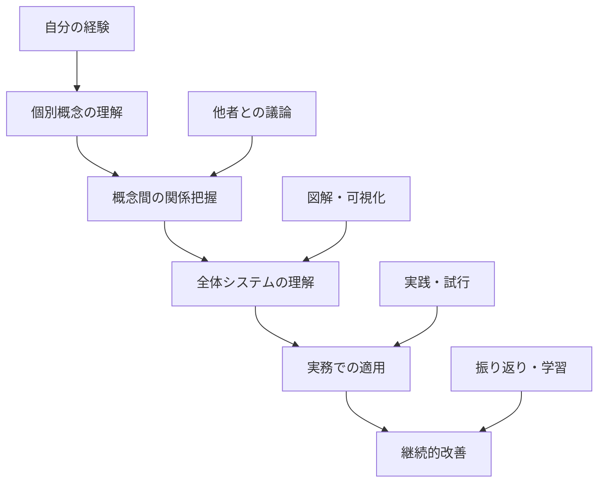

# 🎯 第3章: ソフトウェアテストの全体像 - 学習準備・概要把握

## 📊 学習目標

### 🎯 具体的な学習成果
**理論理解**:
- テストに関わる概念・用語を正確に説明できる
- テスト構成要素の役割・機能を体系的に理解している
- テスト活動間の相互関係・依存性を把握している

**実践能力**:
- プロジェクトのテスト活動を全体最適の視点で設計できる
- 既存テスト活動を分析し改善提案できる
- ステークホルダーとテストについて正確にコミュニケーションできる

**応用力**:
- 様々なプロジェクト形態に適したテスト構成を設計できる
- テスト活動の効率性・効果性を評価・改善できる
- テスト戦略立案の基盤となる全体理解を持っている

## 👥 対象者とレベル設定

### ✅ この章で学ぶべき人
**必須対象**:
- テストエンジニア（すべてのレベル）
- テストマネージャー・リーダー
- プロジェクトマネージャー
- QAエンジニア

**強く推奨**:
- 開発エンジニア（テスト活動に関わる）
- プロダクトマネージャー
- ビジネスアナリスト
- システムアーキテクト

### 📈 前提スキルレベル
**必須**:
- 第1章・第2章の学習完了
- ソフトウェア開発プロセスの基本理解
- テスト活動の基礎経験（半年以上）

**推奨**:
- 複数プロジェクトでのテスト経験
- テスト計画・実行の経験
- プロジェクト管理の基礎知識

## 🎯 具体的成果物設定

### 📝 学習過程での作成物
1. **テスト概念・用語集** (理論学習)
   - 標準的な定義集
   - 実務での使い分けガイド
   - 組織内用語統一提案

2. **テスト構成要素マップ** (基本演習)
   - 構成要素の関係図
   - 各要素の詳細分析
   - プロジェクト適用例

3. **テスト活動設計書** (上級演習)
   - 実プロジェクトでのテスト構成設計
   - 改善提案書
   - 効果測定計画

### 🏆 最終成果物（実務適用レベル）
**テスト全体像実装ガイド**:
- 自組織のテスト活動現状分析
- 最適なテスト構成の設計・提案
- 実装ロードマップとマイルストーン
- 効果測定・継続改善の仕組み

## 🌟 学習の価値と実務インパクト

### 💼 キャリアへの影響
**短期的価値** (1-3ヶ月):
- テスト活動の全体を俯瞰できるようになる
- ステークホルダーとの正確なコミュニケーション
- テスト計画・実行の品質向上

**中期的価値** (3ヶ月-1年):
- テスト戦略立案能力の獲得
- プロジェクト全体を考慮したテスト設計
- テスト活動の効率化・最適化をリード

**長期的価値** (1年以上):
- テストアーキテクトとしての専門性確立
- 組織のテスト成熟度向上をけん引
- 業界でのテストエキスパートとしての地位

### 🏢 組織への貢献
- **テスト効率向上**: 体系的なテスト活動による効率化
- **品質安定化**: 漏れのないテスト構成による品質確保
- **コミュニケーション改善**: 共通理解に基づく円滑な連携
- **ナレッジ蓄積**: テスト活動の体系化・標準化

## 📋 学習前チェックリスト

### ✅ 準備完了確認
- [ ] 第1章「ソフトウェアテストとは」を完了している
- [ ] 第2章「品質マネジメントとソフトウェアテスト」を完了している
- [ ] 自分のテスト活動経験を整理できている
- [ ] 現在のプロジェクトのテスト構成を説明できる
- [ ] 6-8時間の学習時間を確保できている

### 🎯 学習動機の確認
- [ ] テスト活動の全体像を理解したい意欲
- [ ] 正確な概念・用語を身につけたい意欲
- [ ] テスト活動を改善したい具体的なニーズ
- [ ] プロジェクト成功に貢献したい意識

## 🔍 現状理解度の自己診断

### 📊 理解度チェック

以下について、現在の理解度を1-5で評価してください（5が最高）：

```markdown
## テスト理解度自己診断

| 項目 | 理解度(/5) | 学習重点度 |
|------|------------|------------|
| テストの基本概念 |  | 高/中/低 |
| テスト関連用語 |  | 高/中/低 |
| テストレベル・種類 |  | 高/中/低 |
| テストプロセス |  | 高/中/低 |
| テスト技法 |  | 高/中/低 |
| テスト管理 |  | 高/中/低 |
| テスト自動化 |  | 高/中/低 |
| テスト環境 |  | 高/中/低 |

## 実務経験チェック
- [ ] テスト計画の策定経験がある
- [ ] 複数のテストレベルを経験している
- [ ] テスト技法を実務で使用している
- [ ] テストツールを使用している
- [ ] テスト結果の分析・報告経験がある
- [ ] テストプロセス改善に関わった経験がある

## 学習ニーズの特定
### 最も重要な学習ニーズ（上位3つ）
1. 
2. 
3. 

### 解決したい具体的な課題
- 
- 
- 
```

## 🚀 この章で解決される問題

### 🔧 よくある課題と解決

**課題1: テスト用語の混乱**
- **現状**: プロジェクト内でテスト用語の解釈がばらつく
- **解決**: 標準的な概念・用語の理解と統一
- **効果**: 正確なコミュニケーション、認識齟齬の削減

**課題2: テスト活動の全体像不明**
- **現状**: 個別のテスト作業はできるが全体が見えない
- **解決**: テスト構成要素と相互関係の体系的理解
- **効果**: 戦略的なテスト活動、漏れ・重複の防止

**課題3: テスト効率の悪さ**
- **現状**: 場当たり的なテスト活動で効率が悪い
- **解決**: 最適なテスト構成の設計能力習得
- **効果**: テスト効率向上、リソース最適化

**課題4: ステークホルダーとの認識不一致**
- **現状**: テストについて関係者との認識がずれる
- **解決**: 共通理解に基づくコミュニケーション
- **効果**: プロジェクト連携の向上、期待値調整

## 🎯 学習効果を最大化する準備

### 📚 効果的な学習姿勢
1. **体系的理解**: 個別要素から全体システムへの理解
2. **実務連結**: 理論を自分の実務経験と関連付け
3. **視覚的整理**: 図解・マップを活用した理解
4. **継続的振り返り**: 学習内容を実務で確認・実践

### 🤝 学習環境の整備
- **同僚との議論**: テスト活動について議論できる相手
- **実例の準備**: 自分のプロジェクトの具体例
- **ツールの準備**: 図解作成ツール（PowerPoint、Miro等）
- **時間の確保**: 集中して学習できる時間帯

## 🌟 学習のメンタルモデル

### 🧠 効果的な理解の仕方


### 🎯 学習成果の活用イメージ
1. **即時活用**: 現在のプロジェクトでの用語統一・認識共有
2. **短期活用**: 次期プロジェクトのテスト計画品質向上
3. **中期活用**: 組織のテストプロセス改善への貢献
4. **長期活用**: テストエキスパートとしての専門性確立

## 🔄 次のステップ

### 📖 理論学習の準備
- 現在のテスト活動を整理・文書化
- よく使うテスト用語をリストアップ
- プロジェクトのテスト構成を図解してみる

この準備が完了したら、理論学習に進みましょう！