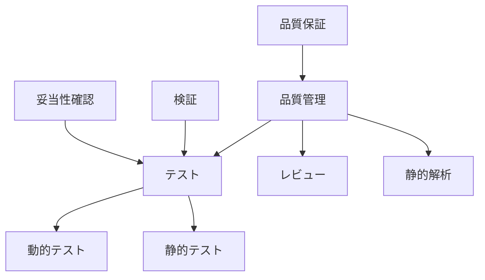
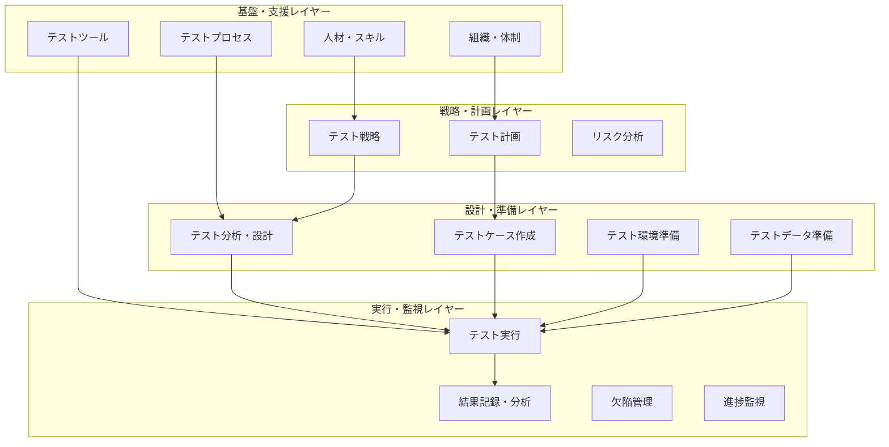
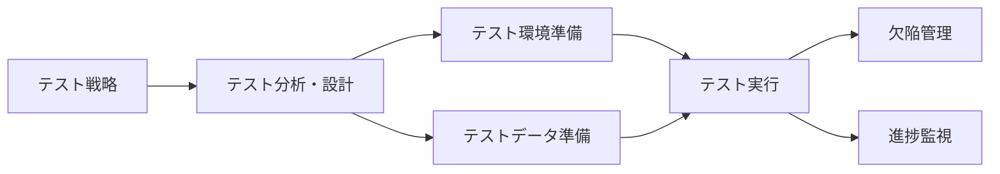
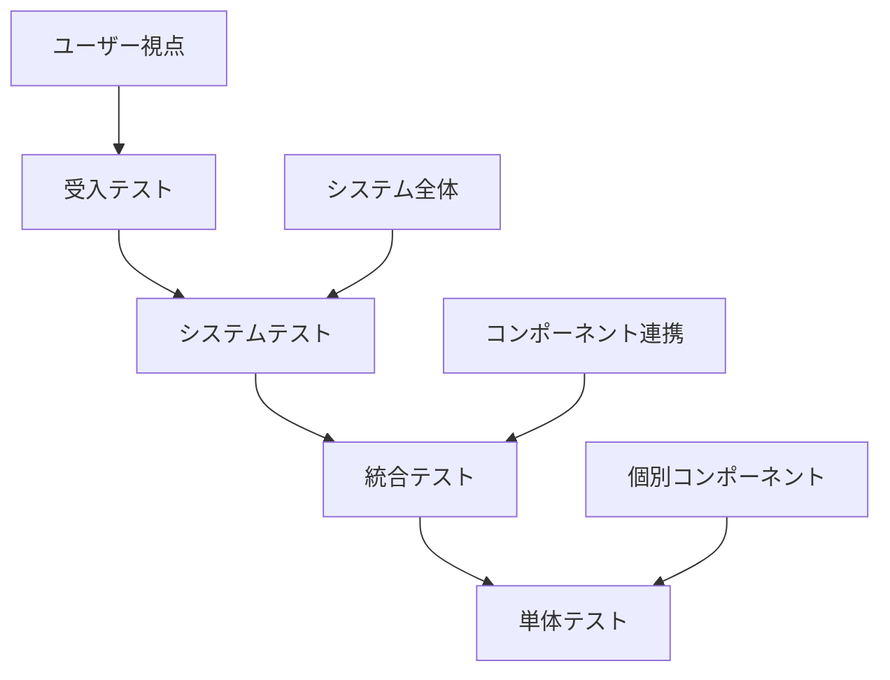
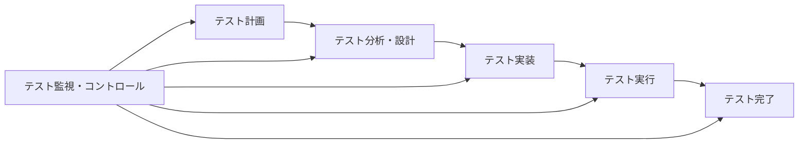

# 📚 第3章: ソフトウェアテストの全体像 - 理論学習・基本演習

## 🎯 理論学習目標
- テストに関わる概念・用語の正確な理解
- テスト構成要素の体系的把握
- テスト活動の相互関係・依存性の理解

---

## 📖 第1部: テストに関わる概念と用語

### 🔍 3.1 基本概念の整理

#### テストの基本定義
**テスト（Testing）**:
> ソフトウェアプロダクトが指定された要件を満たし、期待される品質レベルに達していることを評価するプロセス

**テスト活動の3つの視点**:
1. **検証（Verification）**: 正しく作られているか？
2. **妥当性確認（Validation）**: 正しいものを作っているか？
3. **品質評価（Quality Assessment）**: どの程度の品質か？

#### テストとその他活動の関係



### 📝 テスト基本用語集

#### テストオブジェクト関連
| 用語 | 定義 | 実例 |
|------|------|------|
| テストオブジェクト | テストの対象となるソフトウェア成果物 | アプリケーション、モジュール、仕様書 |
| テストアイテム | 個別のテスト対象項目 | 特定の機能、API、画面 |
| SUT (System Under Test) | テスト中のシステム | テスト実行時の対象システム |
| テストベース | テスト設計の基となる成果物 | 要件仕様書、設計書、ユーザーストーリー |

#### テスト設計・実行関連
| 用語 | 定義 | 実例 |
|------|------|------|
| テストケース | 特定のテスト目的のための条件・手順・期待結果の組み合わせ | ログイン機能の正常系テスト |
| テストスイート | 関連するテストケースの集合 | 会員管理機能テストスイート |
| テストデータ | テスト実行に使用するデータ | ユーザー情報、トランザクションデータ |
| テストハーネス | テスト実行を支援する環境・ツール | テスト実行フレームワーク |

#### テスト結果・評価関連
| 用語 | 定義 | 実例 |
|------|------|------|
| テスト結果 | テスト実行によって得られる結果 | 成功、失敗、エラー |
| 期待結果 | テスト実行で得られるべき結果 | 画面表示内容、データベース状態 |
| 実績結果 | テスト実行で実際に得られた結果 | 実際の画面表示、システム応答 |
| 欠陥（バグ） | 期待結果と実績結果の相違 | 機能動作不良、性能不足 |

### 📊 演習3-1: 用語の正確な理解

**課題**: 以下のテスト活動について、正しい用語を使って説明してください。

**シナリオ**: ECサイトの決済機能について、クレジットカード決済が正常に動作することを確認する活動を実施しています。

```markdown
## 用語使い分け演習

### 状況説明
要件仕様書に基づいて、クレジットカード決済機能の動作を確認するため、
正常な決済処理、エラー処理、金額上限チェックなどの条件で動作を確認し、
期待通りの結果が得られるかを評価する。

### 用語の特定・説明
1. **テストオブジェクト**: 
2. **テストベース**: 
3. **テストケースの例**: 
   - 名前: 
   - 条件: 
   - 期待結果: 
4. **テストデータの例**: 
5. **検証の観点**: 
6. **妥当性確認の観点**: 

### 関連活動との区分
- **テスト活動**: 
- **レビュー活動**: 
- **静的解析活動**: 
```

---

## 📖 第2部: テストの構成要素

### 🏗️ 3.2 テスト構成要素の体系

#### レイヤー構造でのテスト構成要素



### 🎯 主要構成要素の詳細

#### 1. テスト戦略・計画要素

**テスト戦略**:
- **定義**: プロジェクト全体のテストアプローチ
- **含む内容**: テスト方針、テストレベル、テスト技法選択
- **成果物**: テスト戦略書、テストアプローチ文書

**テスト計画**:
- **定義**: 具体的なテスト活動の計画
- **含む内容**: スケジュール、リソース、責任分担
- **成果物**: テスト計画書、WBS、スケジュール

**リスク分析**:
- **定義**: テスト関連リスクの識別・評価・対策
- **含む内容**: プロダクトリスク、プロジェクトリスク
- **成果物**: リスク分析表、対策計画

#### 2. テスト設計・準備要素

**テスト分析・設計**:
- **定義**: テストベースからテスト条件・ケースを導出
- **含む内容**: テスト観点分析、テスト技法適用
- **成果物**: テスト観点リスト、テスト設計仕様書

**テスト環境**:
- **定義**: テスト実行に必要なハードウェア・ソフトウェア環境
- **含む内容**: サーバー、DB、ネットワーク、ツール
- **成果物**: 環境構成図、環境構築手順書

**テストデータ**:
- **定義**: テスト実行に使用するデータ
- **含む内容**: マスタデータ、トランザクションデータ
- **成果物**: テストデータ仕様書、データ作成手順

#### 3. テスト実行・監視要素

**テスト実行**:
- **定義**: テストケースの実行とその結果記録
- **含む内容**: 手動実行、自動実行、結果判定
- **成果物**: テスト実行結果、実行ログ

**欠陥管理**:
- **定義**: 発見された欠陥の管理・追跡
- **含む内容**: 欠陥登録、修正確認、影響分析
- **成果物**: 欠陥レポート、修正確認書

**進捗監視**:
- **定義**: テスト活動の進捗・品質の監視
- **含む内容**: 実行率、合格率、欠陥件数
- **成果物**: 進捗レポート、品質メトリクス

### 📊 演習3-2: 構成要素の関係分析

**課題**: 以下のプロジェクトで必要なテスト構成要素を特定し、関係性を整理してください。

**プロジェクト情報**:
- 新規Webアプリケーション開発
- 開発期間: 6ヶ月
- チーム規模: 15名（開発10名、テスト5名）
- 技術: React, Node.js, PostgreSQL

```markdown
## テスト構成要素設計

### 戦略・計画レイヤー
#### 必要な要素と内容
1. **テスト戦略**:
   - 対象: 
   - アプローチ: 
   - 重点領域: 

2. **テスト計画**:
   - 期間: 
   - 体制: 
   - マイルストーン: 

3. **リスク分析**:
   - 主要リスク: 
   - 対策: 

### 設計・準備レイヤー
#### 必要な要素と内容
1. **テスト分析・設計**:
   - 分析対象: 
   - 使用技法: 
   - 設計方針: 

2. **テスト環境**:
   - 環境構成: 
   - 必要リソース: 
   - 構築スケジュール: 

3. **テストデータ**:
   - データ種類: 
   - 作成方法: 
   - 管理方針: 

### 実行・監視レイヤー
#### 必要な要素と内容
1. **テスト実行**:
   - 実行方式: 
   - 自動化範囲: 
   - 実行スケジュール: 

2. **欠陥管理**:
   - 管理ツール: 
   - ワークフロー: 
   - 品質基準: 

3. **進捗監視**:
   - 監視指標: 
   - 報告頻度: 
   - エスカレーション基準: 

### 要素間の依存関係


### 重要な依存関係の説明
1. **戦略→設計**: 
2. **設計→準備**: 
3. **準備→実行**: 
4. **実行→監視**: 
```

---

## 📖 第3部: テストレベルとテストタイプ

### 🏗️ テストレベルの階層構造

#### テストレベルの定義と特徴



| テストレベル | 目的 | 実施者 | 主なテスト対象 |
|--------------|------|--------|----------------|
| 単体テスト | 個別コンポーネントの動作確認 | 開発者 | モジュール、関数、クラス |
| 統合テスト | コンポーネント間の連携確認 | 開発者・テスター | インターフェース、データフロー |
| システムテスト | システム全体の動作確認 | テスター | 要件仕様、システム仕様 |
| 受入テスト | ビジネス要件の充足確認 | ユーザー・テスター | ユーザー要件、ビジネス要求 |

#### テストタイプの分類

**機能テスト**:
- 適合性テスト、正確性テスト、相互運用性テスト
- セキュリティテスト、アクセシビリティテスト

**非機能テスト**:
- 性能テスト、負荷テスト、ストレステスト
- 使用性テスト、信頼性テスト、保守性テスト

**変更関連テスト**:
- 確認テスト、回帰テスト、影響分析テスト

### 📊 演習3-3: テストレベル・タイプの適用設計

**課題**: 以下の要件に対して、適切なテストレベル・タイプを設計してください。

**システム**: オンライン銀行システム
**主要機能**: 口座照会、振込、入金、ローン申込
**非機能要件**: レスポンス3秒以内、99.9%可用性、セキュリティレベルAA

```markdown
## テストレベル・タイプ設計

### 各テストレベルでの実施内容

#### 単体テスト
**対象コンポーネント**: 
**テスト内容**: 
**重点項目**: 
**実施方法**: 

#### 統合テスト
**統合対象**: 
**テスト内容**: 
**重点項目**: 
**実施方法**: 

#### システムテスト
**システム範囲**: 
**テスト内容**: 
**重点項目**: 
**実施方法**: 

#### 受入テスト
**受入基準**: 
**テスト内容**: 
**重点項目**: 
**実施方法**: 

### テストタイプ別実施計画

#### 機能テスト
| 機能 | テストレベル | 重要度 | 実施方法 |
|------|--------------|--------|----------|
| 口座照会 |  | 高/中/低 |  |
| 振込 |  | 高/中/低 |  |
| 入金 |  | 高/中/低 |  |
| ローン申込 |  | 高/中/低 |  |

#### 非機能テスト
| 非機能要件 | テストレベル | 目標値 | 測定方法 |
|------------|--------------|--------|----------|
| レスポンス性能 |  | 3秒以内 |  |
| 可用性 |  | 99.9% |  |
| セキュリティ |  | レベルAA |  |

#### 変更関連テスト
**回帰テスト範囲**: 
**自動化対象**: 
**実施頻度**: 
```

---

## 📖 第4部: テストプロセスとワークフロー

### 🔄 テストプロセスの基本フロー

#### 標準的なテストプロセス



#### プロセス詳細

**1. テスト計画**:
- テスト戦略の策定
- テスト計画書の作成
- リソース・スケジュール計画

**2. テスト分析・設計**:
- テストベースの分析
- テスト条件の識別
- テストケースの設計

**3. テスト実装**:
- テストケースの実装
- テスト環境の準備
- テストデータの作成

**4. テスト実行**:
- テストケースの実行
- 結果の記録・分析
- 欠陥の報告

**5. テスト完了**:
- 完了基準の確認
- テスト成果物の整理
- 学習内容の記録

### 📊 演習3-4: プロセス最適化設計

**課題**: アジャイル開発での2週間スプリントに適したテストプロセスを設計してください。

```markdown
## アジャイルテストプロセス設計

### スプリント内テストプロセス

#### Week 1
**Day 1-2**: 
- 活動: 
- 成果物: 
- 関与者: 

**Day 3-4**: 
- 活動: 
- 成果物: 
- 関与者: 

**Day 5**: 
- 活動: 
- 成果物: 
- 関与者: 

#### Week 2
**Day 6-8**: 
- 活動: 
- 成果物: 
- 関与者: 

**Day 9-10**: 
- 活動: 
- 成果物: 
- 関与者: 

### プロセス最適化のポイント
1. **効率化**: 
2. **品質確保**: 
3. **迅速性**: 
4. **継続性**: 

### 従来プロセスとの違い
- **計画**: 
- **設計**: 
- **実行**: 
- **完了**: 
```

---

## 🎯 理論学習まとめ

### ✅ 習得すべき重要概念
1. **テスト基本概念・用語の正確な理解**
2. **テスト構成要素の体系的把握**
3. **テストレベル・タイプの適切な適用**
4. **テストプロセスの効果的な設計・運用**

### 🔄 知識の統合
- 個別要素 → 要素間関係 → 全体システム
- 理論的理解 → 実務適用 → 継続的改善

### 📚 次のステップ
理論学習が完了したら、「03_習得レベル確認」で理解度を確認し、理解不足があれば該当部分を復習してから上級演習に進みましょう。

### 📖 参考リソース
- ISTQB Foundation Level Syllabus
- IEEE 829 (Test Documentation Standard)
- ISO/IEC/IEEE 29119 (Software Testing Standards)
- ソフトウェアテストの徹底指南書 第3章