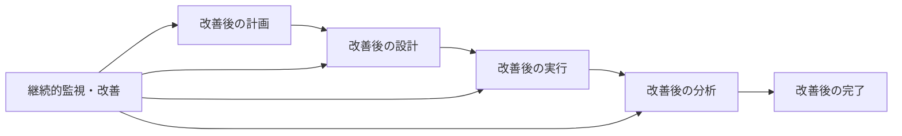

# ✅ 第3章: ソフトウェアテストの全体像 - 習得レベル確認

## 🎯 確認の目的
- テスト概念・用語の正確な理解度評価
- テスト構成要素の体系的理解確認
- 実務でのテスト活動設計能力の確認

---

## 📝 Part A: 理論理解度チェック

### 🔍 A1. 基本概念・用語の理解確認

#### 問題1: テスト基本概念の区別
**設問**: 以下の活動について、検証・妥当性確認・品質評価のどれに該当するか分類し、理由を説明してください。

**活動例**:
1. 実装されたログイン機能が設計仕様通りに動作するかを確認
2. 開発されたシステムが実際のビジネス要件を満たしているかをユーザーが確認
3. システムの性能がどの程度かを測定・評価
4. コードレビューで設計書通りに実装されているかを確認
5. ユーザビリティテストで使いやすさを評価

```markdown
## 分類結果記入欄

| 活動 | 分類 | 理由 |
|------|------|------|
| 1 | 検証/妥当性確認/品質評価 |  |
| 2 | 検証/妥当性確認/品質評価 |  |
| 3 | 検証/妥当性確認/品質評価 |  |
| 4 | 検証/妥当性確認/品質評価 |  |
| 5 | 検証/妥当性確認/品質評価 |  |

## 考察
検証・妥当性確認・品質評価の違いと関係性について：

```

#### 問題2: テスト用語の正確な使い分け
**設問**: 以下の文章で使われているテスト用語が適切かどうか判断し、不適切な場合は正しい用語に修正してください。

**文章**:
「今回のプロジェクトでは、ユーザー管理機能のテストベースとして、テスト仕様書を作成しました。テストオブジェクトに対してテストハーネスを実行し、テスト結果が期待結果と一致することを確認します。不一致があった場合は実績結果として記録し、開発チームに報告します。」

```markdown
## 用語チェック結果

### 不適切な用語とその修正
1. **不適切**: 
   **修正**: 
   **理由**: 

2. **不適切**: 
   **修正**: 
   **理由**: 

3. **不適切**: 
   **修正**: 
   **理由**: 

### 修正後の文章
「今回のプロジェクトでは、ユーザー管理機能の_____として、_____を作成しました。_____に対して_____を実行し、_____が_____と一致することを確認します。不一致があった場合は_____として記録し、開発チームに報告します。」
```

#### 問題3: テスト構成要素の体系理解
**設問**: テスト構成要素の4つのレイヤーについて、各レイヤーの目的と含まれる要素を記述してください。

```markdown
## テスト構成要素レイヤー分析

### 戦略・計画レイヤー
**目的**: 
**主要要素**: 
**成果物例**: 

### 設計・準備レイヤー
**目的**: 
**主要要素**: 
**成果物例**: 

### 実行・監視レイヤー
**目的**: 
**主要要素**: 
**成果物例**: 

### 基盤・支援レイヤー
**目的**: 
**主要要素**: 
**成果物例**: 

### レイヤー間の関係性
上位レイヤーから下位レイヤーへの影響:

下位レイヤーから上位レイヤーへのフィードバック:

```

---

## 🎯 Part B: 実践的思考力チェック

### 🔧 B1. テストレベル・タイプの適用判断

#### ケーススタディ: モバイルアプリ開発プロジェクト

**背景**:
新しいフィットネス追跡モバイルアプリを開発中です。主要機能は歩数計測、カロリー計算、運動記録、SNS共有です。iOS/Android対応で、ウェアラブルデバイスとの連携も予定しています。

**要件**:
- バッテリー消費を最小限に抑制
- データ同期の信頼性確保
- プライバシー保護の徹底
- 直感的で使いやすいUI/UX

**課題**: このプロジェクトに適したテストレベル・タイプを設計してください。

```markdown
## テストレベル・タイプ設計

### 各テストレベルでの重点項目

#### 単体テスト
**対象**: 
**重点項目**: 
**特別な考慮事項**: 

#### 統合テスト
**統合対象**: 
**重点項目**: 
**特別な考慮事項**: 

#### システムテスト
**システム範囲**: 
**重点項目**: 
**特別な考慮事項**: 

#### 受入テスト
**受入観点**: 
**重点項目**: 
**特別な考慮事項**: 

### テストタイプ別戦略

#### 機能テスト
**対象機能**: 
**テスト戦略**: 
**重要度**: 高/中/低

#### 性能テスト
**対象要件**: 
**テスト戦略**: 
**重要度**: 高/中/低

#### 使用性テスト
**対象要件**: 
**テスト戦略**: 
**重要度**: 高/中/低

#### セキュリティテスト
**対象要件**: 
**テスト戦略**: 
**重要度**: 高/中/低

#### 互換性テスト
**対象要件**: 
**テスト戦略**: 
**重要度**: 高/中/低

### モバイルアプリ特有の考慮事項
1. **デバイス多様性への対応**: 
2. **ネットワーク環境の変動**: 
3. **バッテリー・メモリ制約**: 
4. **プラットフォーム差異**: 
```

### 🔧 B2. テストプロセス設計・最適化

#### 課題シナリオ: プロセス改善提案

**現状の問題**:
- テスト計画が形式的で実効性が低い
- テスト設計とテスト実行の連携が悪い
- 欠陥の発見が遅く、修正コストが高い
- テスト結果の分析・活用が不十分
- チーム間のコミュニケーションが不足

**課題**: これらの問題を解決するテストプロセスの改善案を提案してください。

```markdown
## テストプロセス改善提案

### 現状問題の根本原因分析

#### テスト計画の問題
**現状**: 
**根本原因**: 
**影響**: 

#### 設計・実行連携の問題
**現状**: 
**根本原因**: 
**影響**: 

#### 欠陥発見の遅れ
**現状**: 
**根本原因**: 
**影響**: 

#### 結果分析・活用不足
**現状**: 
**根本原因**: 
**影響**: 

#### コミュニケーション不足
**現状**: 
**根本原因**: 
**影響**: 

### 改善プロセス設計

#### 改善されたテストプロセスフロー


#### 各段階の改善内容

**テスト計画段階**:
- 改善内容: 
- 期待効果: 
- 実施方法: 

**テスト設計段階**:
- 改善内容: 
- 期待効果: 
- 実施方法: 

**テスト実行段階**:
- 改善内容: 
- 期待効果: 
- 実施方法: 

**結果分析段階**:
- 改善内容: 
- 期待効果: 
- 実施方法: 

**テスト完了段階**:
- 改善内容: 
- 期待効果: 
- 実施方法: 

### 改善効果の測定

#### 定量指標
- **効率性**: 
- **品質**: 
- **速度**: 

#### 定性指標
- **チーム満足度**: 
- **コミュニケーション**: 
- **知識共有**: 

### 実装計画
| 改善項目 | 優先度 | 期間 | 担当 | 成功指標 |
|----------|--------|------|------|----------|
|  | 高/中/低 |  |  |  |
|  | 高/中/低 |  |  |  |
|  | 高/中/低 |  |  |  |
```

---

## 🎯 Part C: 適用イメージの構築

### 💼 C1. 自組織でのテスト全体像設計

**課題**: あなたの現在の組織・プロジェクトに対して、学習したテスト全体像の知識をどのように適用するか計画してください。

```markdown
## 自組織適用計画

### 現状のテスト活動分析

#### 現在のテスト構成要素
**戦略・計画レイヤー**:
- 現状: 
- 課題: 
- 改善余地: 

**設計・準備レイヤー**:
- 現状: 
- 課題: 
- 改善余地: 

**実行・監視レイヤー**:
- 現状: 
- 課題: 
- 改善余地: 

**基盤・支援レイヤー**:
- 現状: 
- 課題: 
- 改善余地: 

### 用語・概念の統一

#### 現状の用語使用状況
- **統一されている用語**: 
- **混乱している用語**: 
- **不足している概念**: 

#### 改善提案
- **用語統一の方法**: 
- **概念教育の計画**: 
- **ドキュメント整備**: 

### テスト全体像の最適化設計

#### 目指すべき姿（6ヶ月後）
**戦略・計画**: 
**設計・準備**: 
**実行・監視**: 
**基盤・支援**: 

#### 実装ロードマップ
| 時期 | 重点改善領域 | 具体的活動 | 期待効果 |
|------|--------------|------------|----------|
| 1ヶ月目 |  |  |  |
| 2ヶ月目 |  |  |  |
| 3ヶ月目 |  |  |  |
| 4-6ヶ月目 |  |  |  |

### 改善効果の測定計画
**測定指標**: 
**測定方法**: 
**評価基準**: 

### 推進における課題・対策
**予想される課題**: 
**対策案**: 
**成功要因**: 
```

---

## 📊 習得レベル自己評価

### ✅ レベルチェック

各項目について、該当するレベルにチェックを入れてください。

#### 概念・用語理解レベル
- [ ] **基礎レベル**: 基本用語を正しく説明できる
- [ ] **応用レベル**: 用語を適切に使い分けできる
- [ ] **実践レベル**: 他者への説明・指導ができる
- [ ] **エキスパートレベル**: 組織の用語統一をリードできる

#### 構成要素理解レベル
- [ ] **要素レベル**: 個別要素の役割を理解している
- [ ] **関係レベル**: 要素間の関係性を把握している
- [ ] **システムレベル**: 全体システムとして理解している
- [ ] **設計レベル**: 最適な構成を設計できる

#### 実践適用レベル
- [ ] **理解レベル**: 理論的な知識を持っている
- [ ] **分析レベル**: 現状を分析できる
- [ ] **設計レベル**: 改善案を設計できる
- [ ] **実行レベル**: 実際に改善を推進できる

---

## 🎯 学習継続の判定

### ✅ 次ステップへの進行判定

#### 【上級演習に進む条件】
以下をすべて満たしている場合、上級演習に進んでください：
- [ ] Part Aの全問題に正確に回答できた
- [ ] Part Bで実践的で具体的な提案ができた
- [ ] Part Cで自組織への適用計画が明確になった
- [ ] 概念・用語理解レベルが「応用レベル」以上
- [ ] 構成要素理解レベルが「システムレベル」以上

#### 【復習が必要な場合】
以下に該当する場合は、該当部分を復習してください：

**概念・用語理解不足**:
- Part A正答率が8割未満 → 理論学習の第1部を復習
- 用語の使い分けが不正確 → 用語集の再確認・暗記

**構成要素理解不足**:
- 要素間関係が不明確 → 理論学習の第2部を復習
- 全体システムの理解不足 → 図解による整理

**実践適用力不足**:
- Part Bで具体的提案ができない → 他事例の研究
- 自組織適用が不明確 → 現状分析の詳細化

---

## 🔄 復習・補強の指針

### 📚 効果的な復習方法

**概念・用語の強化**:
1. 用語集の作成・暗記
2. 実務での正確な用語使用を意識
3. 同僚との用語統一の議論

**構成要素理解の深化**:
1. 要素関係図の作成・修正
2. 他プロジェクト事例での検証
3. システム思考での全体理解

**実践力の向上**:
1. 小規模な改善提案から開始
2. 成功事例・失敗事例の研究
3. 段階的な適用・検証

### 🎯 次回学習への準備

習得レベル確認が完了したら、以下を準備して上級演習に進みましょう：

- [ ] 理解不足部分の復習完了
- [ ] 自組織の詳細な現状分析
- [ ] 改善提案の基本アイデア整理
- [ ] 実践的な課題の特定