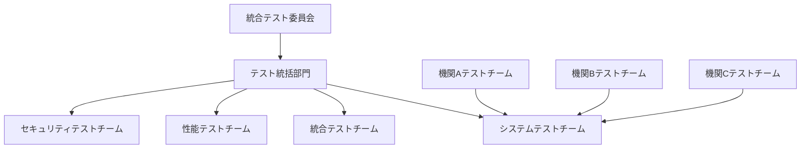
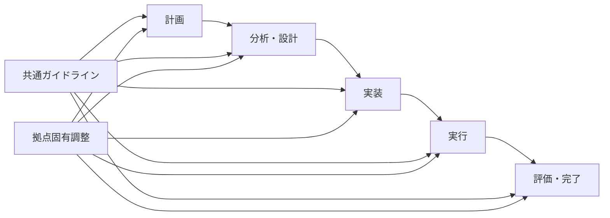

# 🚀 第3章: ソフトウェアテストの全体像 - 上級演習・実務レベル

## 🎯 上級演習の目標
- 複雑なプロジェクト環境でのテスト全体像設計能力
- 組織レベルでのテスト改善・最適化能力
- ステークホルダー調整を含む実践的なテスト戦略立案力

---

## 🏢 演習1: 大規模システム開発でのテスト全体像設計

### 📋 ケーススタディ: 金融機関統合システム

**プロジェクト概要**:
- **システム**: 3つの金融機関の統合基幹システム
- **規模**: 開発期間3年、チーム200名、予算50億円
- **技術**: マイクロサービス、クラウド、AI/ML機能
- **制約**: 規制要件厳格、24時間無停止要求、データマイグレーション

**複雑性要因**:
1. **技術的複雑性**: 異なるレガシーシステムとの統合
2. **組織的複雑性**: 3つの異なる組織文化・プロセス
3. **規制的複雑性**: 金融庁規制、監査要件
4. **運用的複雑性**: 段階的移行、業務継続性確保

### 🎯 演習課題1-A: 包括的テスト戦略設計

**課題**: この大規模プロジェクトに適した包括的なテスト戦略を設計してください。

```markdown
## 包括的テスト戦略設計

### 戦略・計画レイヤーの設計

#### 全体テスト戦略
**戦略方針**:
1. **品質優先**: 
2. **リスク重視**: 
3. **段階的アプローチ**: 
4. **継続的改善**: 

**テストアプローチ**:
- **Vモデル**: 適用範囲・理由
- **アジャイル**: 適用範囲・理由
- **DevOps**: 適用範囲・理由

#### リスクベーステスト戦略
**高リスク領域の特定**:
| リスク領域 | リスクレベル | 影響度 | 対策戦略 |
|------------|--------------|--------|----------|
| データマイグレーション | 高/中/低 |  |  |
| システム統合 | 高/中/低 |  |  |
| 性能・可用性 | 高/中/低 |  |  |
| セキュリティ | 高/中/低 |  |  |
| 規制準拠 | 高/中/低 |  |  |

#### テスト組織・体制設計


**役割・責任**:
| 組織 | 責任範囲 | 人数 | 必要スキル |
|------|----------|------|------------|
| 統合テスト委員会 |  |  |  |
| テスト統括部門 |  |  |  |
| システムテストチーム |  |  |  |
| 統合テストチーム |  |  |  |

### 設計・準備レイヤーの設計

#### テスト環境戦略
**環境構成**:


**各環境の設計**:
| 環境 | 目的 | 構成 | データ | 管理方針 |
|------|------|------|--------|----------|
| 結合テスト |  |  |  |  |
| システムテスト |  |  |  |  |
| ユーザー受入 |  |  |  |  |
| 本番準備 |  |  |  |  |

#### テストデータ戦略
**データ分類**:
- **マスタデータ**: 顧客、商品、組織
- **トランザクションデータ**: 取引、口座、ローン
- **設定データ**: システム設定、業務パラメータ

**データ管理方針**:
1. **データ作成**: 
2. **データ保護**: 
3. **データ更新**: 
4. **データ削除**: 

### 実行・監視レイヤーの設計

#### テスト実行戦略
**段階的実行計画**:
| フェーズ | 期間 | 対象 | 重点項目 | 合格基準 |
|----------|------|------|----------|----------|
| Phase1 |  |  |  |  |
| Phase2 |  |  |  |  |
| Phase3 |  |  |  |  |
| Phase4 |  |  |  |  |

#### 品質監視・コントロール
**監視指標**:
- **進捗指標**: テスト実行率、完了率
- **品質指標**: 欠陥密度、重大度分布
- **効率指標**: 生産性、自動化率

**コントロール基準**:
| 指標 | 警告レベル | 危険レベル | 対応策 |
|------|------------|------------|--------|
| 欠陥密度 |  |  |  |
| 重大度1欠陥数 |  |  |  |
| テスト実行遅延 |  |  |  |

### 基盤・支援レイヤーの設計

#### テストツール戦略
**ツール分類別選定**:
| カテゴリ | ツール候補 | 選定理由 | 適用範囲 |
|----------|------------|----------|----------|
| テスト管理 |  |  |  |
| 自動化ツール |  |  |  |
| 性能テスト |  |  |  |
| セキュリティテスト |  |  |  |

#### 継続的改善の仕組み
**改善サイクル**:
1. **日次**: 
2. **週次**: 
3. **月次**: 
4. **フェーズ終了時**: 
```

### 🎯 演習課題1-B: 段階的移行テスト計画

**課題**: 3つの金融機関の段階的システム移行に対応したテスト計画を立案してください。

```markdown
## 段階的移行テスト計画

### 移行シナリオ設計

#### 移行順序・スケジュール
**Year 1**: 機関A移行
- **Q1**: 準備・環境構築
- **Q2**: 並行稼働開始
- **Q3**: 段階的移行
- **Q4**: 完全移行・安定化

**Year 2**: 機関B移行
- **Q1**: 準備・統合テスト
- **Q2**: 並行稼働開始
- **Q3**: 段階的移行
- **Q4**: 完全移行・安定化

**Year 3**: 機関C移行・統合完了
- **Q1**: 準備・統合テスト
- **Q2**: 並行稼働開始
- **Q3**: 段階的移行・統合
- **Q4**: 全体最適化・安定化

### 移行段階別テスト戦略

#### 準備段階テスト
**目的**: 
**対象**: 
**重点項目**: 
**合格基準**: 

#### 並行稼働段階テスト
**目的**: 
**対象**: 
**重点項目**: 
**合格基準**: 

#### 段階的移行段階テスト
**目的**: 
**対象**: 
**重点項目**: 
**合格基準**: 

#### 完全移行段階テスト
**目的**: 
**対象**: 
**重点項目**: 
**合格基準**: 

### リスク管理・緊急時対応

#### 移行リスクとテスト対策
| リスク | 発生確率 | 影響度 | テスト対策 | 緊急時対応 |
|--------|----------|--------|------------|------------|
| データ不整合 |  |  |  |  |
| 性能劣化 |  |  |  |  |
| 業務停止 |  |  |  |  |
| セキュリティ侵害 |  |  |  |  |

#### 緊急時テスト体制
**通常時体制**: 
**緊急時体制**: 
**エスカレーション**: 
**意思決定**: 

### 移行効果測定

#### 成功指標
**技術指標**: 
**業務指標**: 
**ユーザー指標**: 

#### 測定・評価方法
**測定頻度**: 
**評価基準**: 
**改善アクション**: 
```

---

## 🔄 演習2: テストプロセス変革・最適化

### 📋 ケーススタディ: グローバル企業のテスト標準化

**企業概要**:
- **業界**: グローバルIT企業
- **規模**: 従業員10,000名、開発拠点15カ国
- **事業**: 複数プロダクトライン、B2B/B2Cサービス
- **課題**: 拠点ごとの品質ばらつき、テストプロセス非効率

**現状の問題**:
1. **プロセス統一性不足**: 拠点ごとに異なるテストプロセス
2. **品質ばらつき**: 拠点間での品質レベル差
3. **知識共有不足**: ベストプラクティスの共有不足
4. **効率性問題**: 重複作業、非効率なプロセス
5. **スケーラビリティ不足**: 事業拡大に対応できない体制

### 🎯 演習課題2-A: グローバルテスト標準化設計

**課題**: 15カ国の開発拠点に適用可能なテスト標準化フレームワークを設計してください。

```markdown
## グローバルテスト標準化フレームワーク

### 標準化戦略・アプローチ

#### 標準化の基本方針
1. **統一性と柔軟性の両立**: 
2. **段階的展開**: 
3. **現地適応**: 
4. **継続的改善**: 

#### 標準化レベルの設定
**Level 1 (必須標準)**: 
- 対象: 
- 内容: 
- 遵守要求: 

**Level 2 (推奨標準)**: 
- 対象: 
- 内容: 
- 遵守要求: 

**Level 3 (拠点固有)**: 
- 対象: 
- 内容: 
- 遵守要求: 

### グローバルテストプロセス標準

#### 標準テストプロセスフロー


#### 各段階の標準化内容

**テスト計画段階**:
- **必須項目**: 
- **推奨項目**: 
- **拠点調整**: 
- **成果物**: 

**テスト分析・設計段階**:
- **必須項目**: 
- **推奨項目**: 
- **拠点調整**: 
- **成果物**: 

**テスト実装段階**:
- **必須項目**: 
- **推奨項目**: 
- **拠点調整**: 
- **成果物**: 

**テスト実行段階**:
- **必須項目**: 
- **推奨項目**: 
- **拠点調整**: 
- **成果物**: 

**テスト評価・完了段階**:
- **必須項目**: 
- **推奨項目**: 
- **拠点調整**: 
- **成果物**: 

### 品質保証・ガバナンス体制

#### グローバル品質ガバナンス
```mermaid
graph TD
    A[グローバルQuality Council] --> B[Regional Quality Center]
    B --> C[Local Quality Team]
    
    D[COE (Center of Excellence)] --> A
    E[Quality Standards] --> B
    F[Local Practices] --> C
```

**各レベルの役割**:
| レベル | 役割 | 責任 | 権限 |
|--------|------|------|------|
| Global |  |  |  |
| Regional |  |  |  |
| Local |  |  |  |

#### 品質監査・評価体制
**監査頻度**: 
**監査項目**: 
**評価基準**: 
**改善要求**: 

### ツール・技術標準化

#### 標準ツールセット
| カテゴリ | グローバル標準 | リージョナル選択 | ローカル選択 |
|----------|----------------|------------------|--------------|
| テスト管理 |  |  |  |
| 自動化フレームワーク |  |  |  |
| 性能テスト |  |  |  |
| セキュリティテスト |  |  |  |

#### 技術標準・ガイドライン
**必須技術標準**: 
**推奨技術標準**: 
**技術評価プロセス**: 

### 知識管理・人材育成

#### グローバル知識共有プラットフォーム
**プラットフォーム設計**: 
**コンテンツ分類**: 
**更新・管理方法**: 

#### 人材育成・認定体制
**スキルレベル定義**: 
- Level 1: 
- Level 2: 
- Level 3: 
- Level 4: 

**認定プロセス**: 
**継続教育**: 

### 展開・浸透戦略

#### 段階的展開計画
**Phase 1 (3ヶ月)**: パイロット拠点での実証
**Phase 2 (6ヶ月)**: 主要拠点への展開
**Phase 3 (12ヶ月)**: 全拠点への展開・定着

#### 変革管理・コミュニケーション
**ステークホルダー管理**: 
**コミュニケーション計画**: 
**抵抗対応策**: 

### 効果測定・継続改善

#### 標準化効果指標
**効率性指標**: 
**品質指標**: 
**満足度指標**: 

#### 継続改善の仕組み
**改善提案プロセス**: 
**標準更新プロセス**: 
**ベストプラクティス共有**: 
```

### 🎯 演習課題2-B: 文化・言語の違いへの対応策

**課題**: 異なる文化・言語環境での標準化における課題と対応策を分析・提案してください。

```markdown
## 文化・言語対応戦略

### 文化的差異の分析・対応

#### 地域別文化特性分析
**アジア太平洋地域**:
- **文化的特徴**: 
- **テストへの影響**: 
- **対応策**: 

**ヨーロッパ地域**:
- **文化的特徴**: 
- **テストへの影響**: 
- **対応策**: 

**北米地域**:
- **文化的特徴**: 
- **テストへの影響**: 
- **対応策**: 

**南米地域**:
- **文化的特徴**: 
- **テストへの影響**: 
- **対応策**: 

#### 文化的適応戦略
**コミュニケーションスタイル**: 
- 高コンテクスト文化: 
- 低コンテクスト文化: 

**意思決定スタイル**: 
- 合意重視型: 
- トップダウン型: 

**時間観念**: 
- 単時間文化: 
- 多時間文化: 

### 言語・コミュニケーション対応

#### 多言語対応戦略
**標準文書の多言語化**: 
- 対象文書: 
- 翻訳品質確保: 
- 更新管理: 

**コミュニケーション支援**: 
- 共通言語設定: 
- 通訳・翻訳支援: 
- 文化的橋渡し役: 

#### テクニカルコミュニケーション
**技術用語統一**: 
**図解・ビジュアル活用**: 
**実践的ワークショップ**: 

### 地域適応・カスタマイズ

#### 法規制・コンプライアンス対応
| 地域 | 主要規制 | テストへの影響 | 対応策 |
|------|----------|----------------|--------|
| EU | GDPR |  |  |
| 米国 | SOX法 |  |  |
| 日本 | 個人情報保護法 |  |  |
| 中国 | サイバーセキュリティ法 |  |  |

#### ビジネス慣行・商習慣対応
**契約・取引形態**: 
**品質基準・期待値**: 
**リスク許容度**: 

### 成功要因・リスク管理

#### 成功要因
1. **リーダーシップ**: 
2. **現地パートナーシップ**: 
3. **継続的学習**: 
4. **柔軟性**: 

#### リスク管理
**高リスク要因**: 
**早期警告指標**: 
**リスク軽減策**: 

### 効果測定・評価

#### 文化適応効果指標
**定量指標**: 
**定性指標**: 
**測定方法**: 

#### 継続的改善
**フィードバック収集**: 
**ベストプラクティス蓄積**: 
**標準進化**: 
```

---

## 🎯 上級演習まとめ

### ✅ 習得すべき上級スキル
1. **大規模・複雑プロジェクトでのテスト全体像設計能力**
2. **組織レベルでのテストプロセス変革・最適化能力**
3. **グローバル・多文化環境での標準化推進能力**
4. **戦略的思考と実行力の統合**

### 🔄 実務適用への準備
上級演習完了後は、以下を実施して実務適用の準備を整えましょう：

1. **自組織の複雑性分析**: 技術的・組織的・文化的複雑性の評価
2. **段階的改善計画**: 現実的で実現可能な改善ロードマップ
3. **ステークホルダー分析**: 関係者の影響力・関心度の把握
4. **変革推進体制**: 改善を推進する組織・人材の確保

### 📚 次のステップ
「05_追加演習・補強練習」で理解不足分野を補強するか、「06_実務適用ガイド」で実際の適用方法を学習しましょう。

### 💡 継続的成長のために
- 業界動向・最新技術の継続的学習
- 他組織・他業界の事例研究
- 専門コミュニティへの参加・貢献
- 自組織での実践・改善の継続