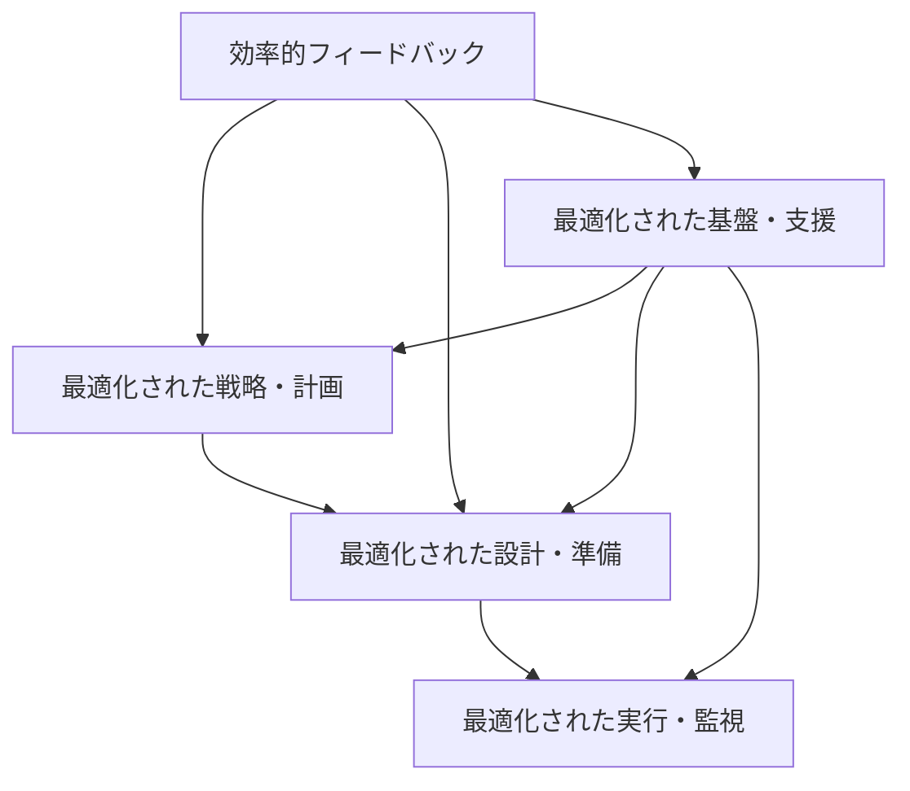
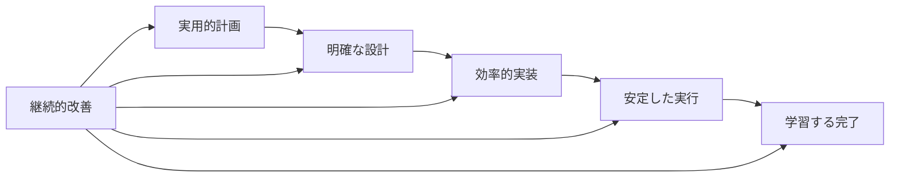

# 🔄 第3章: ソフトウェアテストの全体像 - 追加演習・補強練習

## 🎯 補強練習の目的
- 理解不足分野の集中的な強化
- 多様なプロジェクト形態での応用力向上
- 実務適用前の総合力確認

---

## 📊 理解度別補強練習メニュー

### 🔍 分野別自己診断

各分野について、理解度を1-5で自己評価してください（5が最高）：

```markdown
## 理解度自己診断

| 分野 | 理解度(/5) | 補強の必要性 |
|------|------------|--------------|
| テスト基本概念・用語 |  | 高/中/低 |
| テスト構成要素の体系 |  | 高/中/低 |
| テストレベル・タイプ |  | 高/中/低 |
| テストプロセス設計 |  | 高/中/低 |
| テスト環境・データ |  | 高/中/低 |
| テスト監視・制御 |  | 高/中/低 |
| テスト改善・最適化 |  | 高/中/低 |

## 優先補強領域
1. **最優先**: 
2. **高優先**: 
3. **中優先**: 
```

---

## 🔤 補強練習A: テスト概念・用語の完全習得

### 🎯 対象者
- 基本概念・用語の理解度が3以下の学習者
- 用語の使い分けがあいまいな学習者

### 📝 練習A-1: 概念マップ作成演習

**課題**: テスト関連概念の包括的な概念マップを作成してください。

```markdown
## テスト概念マップ作成

### 中心概念: ソフトウェアテスト

#### レベル1概念（直接関連）
- 検証（Verification）: 
- 妥当性確認（Validation）: 
- 品質保証（Quality Assurance）: 
- 品質管理（Quality Control）: 

#### レベル2概念（間接関連）
- 欠陥（Defect）: 
- エラー（Error）: 
- 故障（Failure）: 
- テストケース（Test Case）: 
- テストスイート（Test Suite）: 

#### レベル3概念（活動・成果物）
- テスト計画（Test Planning）: 
- テスト設計（Test Design）: 
- テスト実行（Test Execution）: 
- テスト報告（Test Reporting）: 

### 概念間の関係性
1. **検証 ⇔ 妥当性確認**: 
2. **品質保証 ⇔ 品質管理**: 
3. **エラー → 欠陥 → 故障**: 
4. **テスト計画 → テスト設計 → テスト実行**: 

### 実務での使い分け例
**プロジェクト会議での説明**:
「今回の___では、___を実施し、___の確認を行います。___が発見された場合は、___として記録し、___プロセスに従って対応します。」

**ステークホルダーへの報告**:
「___活動により、___の___を確認しました。___件の___が発見されましたが、すべて___済みです。」
```

### 📝 練習A-2: 用語クイズ・チャレンジ

**課題**: 以下の用語について、正確な定義と使用例を記述してください。

```markdown
## テスト用語マスタリー

### 基本用語セット1
1. **テストベース**:
   - 定義: 
   - 使用例: 
   - 混同しやすい用語との違い: 

2. **テストオラクル**:
   - 定義: 
   - 使用例: 
   - 混同しやすい用語との違い: 

3. **テストハーネス**:
   - 定義: 
   - 使用例: 
   - 混同しやすい用語との違い: 

### 基本用語セット2
4. **テストダブル**:
   - 定義: 
   - 使用例: 
   - 混同しやすい用語との違い: 

5. **テストフィクスチャ**:
   - 定義: 
   - 使用例: 
   - 混同しやすい用語との違い: 

6. **テストドライバ**:
   - 定義: 
   - 使用例: 
   - 混同しやすい用語との違い: 

### 応用用語セット
7. **テストピラミッド**:
   - 定義: 
   - 使用例: 
   - 混同しやすい用語との違い: 

8. **シフトレフト**:
   - 定義: 
   - 使用例: 
   - 混同しやすい用語との違い: 

9. **フラッキーテスト**:
   - 定義: 
   - 使用例: 
   - 混同しやすい用語との違い: 

### 用語使用文の添削
**Before**: 「テストプランに基づいてテストスイートを実行し、テストレポートを作成します。」
**After**: 
**改善理由**: 
```

### 📝 練習A-3: 業界・分野別用語応用

**課題**: 異なる業界・分野でのテスト用語の使い方を整理してください。

```markdown
## 業界別テスト用語応用

### 金融業界
**特有の用語・概念**:
1. 
2. 
3. 
**一般用語の特殊解釈**:
- テストケース: 
- 回帰テスト: 
- セキュリティテスト: 

### 医療・ヘルスケア業界
**特有の用語・概念**:
1. 
2. 
3. 
**一般用語の特殊解釈**:
- 検証: 
- 妥当性確認: 
- リスクベーステスト: 

### ゲーム業界
**特有の用語・概念**:
1. 
2. 
3. 
**一般用語の特殊解釈**:
- ユーザビリティテスト: 
- 性能テスト: 
- デバッグ: 

### IoT・組み込み業界
**特有の用語・概念**:
1. 
2. 
3. 
**一般用語の特殊解釈**:
- システムテスト: 
- 統合テスト: 
- 環境テスト: 

### 業界横断での共通理解
**統一すべき用語**: 
**業界固有を認める用語**: 
**注意が必要な用語**: 
```

---

## 🏗️ 補強練習B: テスト構成要素設計力強化

### 🎯 対象者
- テスト構成要素の関係性理解が不十分な学習者
- 全体最適の視点が不足している学習者

### 📝 練習B-1: 構成要素バランス分析

**課題**: 以下のプロジェクト特性に応じた最適なテスト構成要素バランスを設計してください。

```markdown
## プロジェクト特性別構成要素設計

### プロジェクトA: スタートアップMVP開発
**特性**: 短期間、少人数、市場検証重視、技術的不確実性高

#### 戦略・計画レイヤー（重要度: 高/中/低）
**重要度**: 
**重点要素**: 
**軽量化する要素**: 
**理由**: 

#### 設計・準備レイヤー（重要度: 高/中/低）
**重要度**: 
**重点要素**: 
**軽量化する要素**: 
**理由**: 

#### 実行・監視レイヤー（重要度: 高/中/低）
**重要度**: 
**重点要素**: 
**軽量化する要素**: 
**理由**: 

#### 基盤・支援レイヤー（重要度: 高/中/低）
**重要度**: 
**重点要素**: 
**軽量化する要素**: 
**理由**: 

### プロジェクトB: 大企業の基幹システム更改
**特性**: 長期間、大規模、高品質要求、規制準拠必須

#### 戦略・計画レイヤー（重要度: 高/中/低）
**重要度**: 
**重点要素**: 
**重点投資する要素**: 
**理由**: 

#### 設計・準備レイヤー（重要度: 高/中/低）
**重要度**: 
**重点要素**: 
**重点投資する要素**: 
**理由**: 

#### 実行・監視レイヤー（重要度: 高/中/低）
**重要度**: 
**重点要素**: 
**重点投資する要素**: 
**理由**: 

#### 基盤・支援レイヤー（重要度: 高/中/低）
**重要度**: 
**重点要素**: 
**重点投資する要素**: 
**理由**: 

### プロジェクトC: AIサービス開発
**特性**: 実験的要素高、データ依存、継続学習、品質定義困難

#### 各レイヤーの特殊考慮事項
**戦略・計画**: 
**設計・準備**: 
**実行・監視**: 
**基盤・支援**: 

### バランス設計の原則
1. **リソース制約との整合**: 
2. **リスクレベルとの対応**: 
3. **組織能力との適合**: 
4. **技術特性への対応**: 
```

### 📝 練習B-2: 構成要素間依存関係分析

**課題**: テスト構成要素間の複雑な依存関係を分析し、最適化を提案してください。

```markdown
## 構成要素依存関係分析・最適化

### 依存関係マッピング

#### 戦略・計画 → 他レイヤーへの影響
**設計・準備への影響**:
- テスト戦略 → テスト設計: 
- リスク分析 → テスト優先順位: 
- 品質目標 → テスト基準: 

**実行・監視への影響**:
- テスト計画 → 実行スケジュール: 
- リソース計画 → 実行体制: 

**基盤・支援への影響**:
- 技術戦略 → ツール選定: 
- 組織戦略 → スキル要件: 

#### 下位レイヤー → 上位レイヤーへのフィードバック
**実行結果 → 戦略調整**:
- 欠陥傾向 → リスク評価見直し: 
- 効率性データ → プロセス改善: 
- 品質データ → 基準調整: 

#### 同一レイヤー内の依存関係
**設計・準備レイヤー内**:
- テスト設計 ⇔ 環境設計: 
- 環境設計 ⇔ データ設計: 
- データ設計 ⇔ テスト設計: 

### 依存関係の問題分析

#### よくある問題パターン
1. **循環依存**: 
   - 発生状況: 
   - 問題の影響: 
   - 解決策: 

2. **過度な結合**: 
   - 発生状況: 
   - 問題の影響: 
   - 解決策: 

3. **依存関係の欠如**: 
   - 発生状況: 
   - 問題の影響: 
   - 解決策: 

### 最適化設計

#### 依存関係の最適化原則
1. **最小結合の原則**: 
2. **明確なインターフェース**: 
3. **段階的詳細化**: 
4. **フィードバックループ**: 

#### 最適化された依存関係設計


#### 最適化の効果測定
**効率性向上**: 
**品質向上**: 
**リスク軽減**: 
```

### 📝 練習B-3: 構成要素進化・改善設計

**課題**: テスト構成要素の継続的進化・改善の仕組みを設計してください。

```markdown
## テスト構成要素進化設計

### 進化・改善の駆動要因

#### 外部要因
**技術進歩**: 
- 新技術の登場: 
- ツールの進歩: 
- 手法の発展: 

**ビジネス環境変化**: 
- 市場要求の変化: 
- 競争環境の変化: 
- 規制の変化: 

#### 内部要因
**組織成熟度向上**: 
- スキルレベル向上: 
- プロセス成熟度向上: 
- 文化の変化: 

**学習・経験蓄積**: 
- 失敗からの学習: 
- 成功事例の蓄積: 
- ベストプラクティス化: 

### 進化・改善メカニズム

#### 継続的監視
**監視対象**: 
- 効率性指標: 
- 品質指標: 
- 満足度指標: 

**監視方法**: 
- 自動収集: 
- 定期調査: 
- フィードバック収集: 

#### 改善トリガー
**定期見直し**: 
- 頻度: 
- 対象: 
- 実施方法: 

**問題発生時**: 
- 緊急改善: 
- 根本原因対応: 
- 予防策実装: 

**機会発見時**: 
- 新技術評価: 
- ベンチマーク: 
- イノベーション: 

### 進化パターンの設計

#### 段階的進化
**Level 1 → Level 2**: 
- 変化内容: 
- 移行方法: 
- 評価基準: 

**Level 2 → Level 3**: 
- 変化内容: 
- 移行方法: 
- 評価基準: 

#### 革新的進化
**破壊的変化への対応**: 
- 変化検知: 
- 影響分析: 
- 移行戦略: 

### 進化管理体制

#### 改善推進組織
**役割・責任**: 
**意思決定権限**: 
**リソース**: 

#### 変更管理プロセス
**提案 → 評価 → 承認 → 実装 → 評価**:
- 各段階の基準: 
- 品質ゲート: 
- ロールバック計画: 
```

---

## 🔄 補強練習C: テストプロセス実践力強化

### 🎯 対象者
- テストプロセス設計・最適化が苦手な学習者
- 理論と実践のギャップを感じている学習者

### 📝 練習C-1: プロセス診断・改善演習

**課題**: 以下の問題があるテストプロセスを診断し、改善案を提案してください。

```markdown
## テストプロセス診断・改善

### 現状プロセスの問題
**症状**:
- テスト計画が形式的で現場で活用されない
- テスト設計と実装の境界があいまい
- テスト実行で多くの手戻りが発生
- 欠陥の根本原因分析が不十分
- プロジェクト間でのナレッジ共有がない

### 根本原因分析

#### プロセス設計の問題
**テスト計画プロセス**:
- 問題: 
- 根本原因: 
- 影響: 

**テスト設計プロセス**:
- 問題: 
- 根本原因: 
- 影響: 

**テスト実行プロセス**:
- 問題: 
- 根本原因: 
- 影響: 

#### 組織・体制の問題
**役割・責任**:
- 問題: 
- 根本原因: 
- 影響: 

**コミュニケーション**:
- 問題: 
- 根本原因: 
- 影響: 

**スキル・教育**:
- 問題: 
- 根本原因: 
- 影響: 

### 改善プロセス設計

#### 改善されたプロセスフロー


#### 各段階の改善内容
**実用的テスト計画**:
- 改善内容: 
- 具体的変更: 
- 期待効果: 

**明確なテスト設計**:
- 改善内容: 
- 具体的変更: 
- 期待効果: 

**効率的テスト実装**:
- 改善内容: 
- 具体的変更: 
- 期待効果: 

**安定したテスト実行**:
- 改善内容: 
- 具体的変更: 
- 期待効果: 

**学習するテスト完了**:
- 改善内容: 
- 具体的変更: 
- 期待効果: 

### 改善実装計画

#### 段階的実装
**Phase 1 (1ヶ月)**: 緊急改善
- 対象: 
- 活動: 
- 成功指標: 

**Phase 2 (3ヶ月)**: プロセス改善
- 対象: 
- 活動: 
- 成功指標: 

**Phase 3 (6ヶ月)**: 文化変革
- 対象: 
- 活動: 
- 成功指標: 

#### 変革管理
**ステークホルダー管理**: 
**コミュニケーション戦略**: 
**抵抗対応**: 
**成功の確保**: 
```

### 📝 練習C-2: 異なる開発手法での最適化

**課題**: ウォーターフォール、アジャイル、DevOpsそれぞれに最適なテストプロセスを設計してください。

```markdown
## 開発手法別テストプロセス最適化

### ウォーターフォール向け最適化

#### プロセス特性
**利点**: 
**制約**: 
**リスク**: 

#### 最適化されたテストプロセス
**計画段階**:
- 重点活動: 
- 成果物: 
- 品質ゲート: 

**設計段階**:
- 重点活動: 
- 成果物: 
- 品質ゲート: 

**実装段階**:
- 重点活動: 
- 成果物: 
- 品質ゲート: 

**実行段階**:
- 重点活動: 
- 成果物: 
- 品質ゲート: 

### アジャイル向け最適化

#### プロセス特性
**利点**: 
**制約**: 
**リスク**: 

#### スプリント内テストプロセス
**スプリント計画**:
- Day 1: 
- 重点活動: 
- 成果物: 

**スプリント実行**:
- Day 2-8: 
- 重点活動: 
- 成果物: 

**スプリント終了**:
- Day 9-10: 
- 重点活動: 
- 成果物: 

#### 継続的改善サイクル
**デイリー改善**: 
**スプリント振り返り**: 
**リリース振り返り**: 

### DevOps向け最適化

#### プロセス特性
**利点**: 
**制約**: 
**リスク**: 

#### 継続的テストプロセス
**コミット段階**:
- 重点活動: 
- 自動化範囲: 
- 品質ゲート: 

**ビルド段階**:
- 重点活動: 
- 自動化範囲: 
- 品質ゲート: 

**デプロイ段階**:
- 重点活動: 
- 自動化範囲: 
- 品質ゲート: 

**運用段階**:
- 重点活動: 
- 自動化範囲: 
- 品質ゲート: 

### 手法横断での共通要素
**共通プロセス**: 
**共通ツール**: 
**共通スキル**: 
**相互移行時の考慮事項**: 
```

---

## 🎯 補強練習D: 総合実践力確認

### 🎯 対象者
- すべての学習者（最終確認）
- 実務適用前の総合力チェック

### 📝 練習D-1: 総合ケーススタディ

**課題**: 以下の複合的な課題に対し、テスト全体像の知識を総動員して解決策を提案してください。

**複合課題シナリオ**:
新興国に進出する日本企業が、現地向けモバイル決済サービスを開発中。以下の複合的課題が発生：

1. **技術的課題**: 現地の通信インフラが不安定、多様なデバイス対応
2. **組織的課題**: 日本と現地開発チームの連携、スキルレベル差
3. **文化的課題**: 現地の商習慣・法規制への対応、UI/UX要求の違い
4. **時間的課題**: 競合他社の脅威、早期市場投入の必要性
5. **品質的課題**: 金融サービスの高品質要求、セキュリティ要件

```markdown
## 総合解決策提案

### 課題の構造化・優先順位付け

#### 課題マトリックス分析
| 課題 | 緊急性 | 重要性 | 影響範囲 | 解決難易度 | 優先順位 |
|------|--------|--------|----------|------------|----------|
| 技術的課題 |  |  |  |  |  |
| 組織的課題 |  |  |  |  |  |
| 文化的課題 |  |  |  |  |  |
| 時間的課題 |  |  |  |  |  |
| 品質的課題 |  |  |  |  |  |

#### 課題間の相互関係
**相互強化する課題**: 
**トレードオフ関係**: 
**解決の前提条件**: 

### テスト全体像での統合解決策

#### 戦略・計画レイヤーでの対応
**多文化対応テスト戦略**:
- 現地適応要素: 
- 共通標準要素: 
- 段階的展開計画: 

**リスクベーステスト計画**:
- 高リスク領域: 
- リスク軽減策: 
- 緊急時対応: 

#### 設計・準備レイヤーでの対応
**分散開発対応テスト設計**:
- 役割分担設計: 
- コミュニケーション設計: 
- 品質保証設計: 

**現地環境対応準備**:
- 環境構築戦略: 
- データ準備戦略: 
- インフラ対応: 

#### 実行・監視レイヤーでの対応
**効率的テスト実行**:
- 自動化戦略: 
- 手動テスト最適化: 
- 並行実行計画: 

**リアルタイム品質監視**:
- 監視指標: 
- 早期警告システム: 
- 迅速対応体制: 

#### 基盤・支援レイヤーでの対応
**グローバル対応基盤**:
- ツール標準化: 
- スキル育成: 
- 知識共有: 

### 段階的実装ロードマップ

#### Phase 1 (1-2ヶ月): 基盤構築
**目標**: 
**主要活動**: 
**成功指標**: 
**リスク対策**: 

#### Phase 2 (3-4ヶ月): 本格開発
**目標**: 
**主要活動**: 
**成功指標**: 
**リスク対策**: 

#### Phase 3 (5-6ヶ月): 市場投入
**目標**: 
**主要活動**: 
**成功指標**: 
**リスク対策**: 

### 成功要因・継続改善

#### 成功要因
1. **リーダーシップ**: 
2. **文化的適応**: 
3. **技術的革新**: 
4. **継続的学習**: 

#### 継続改善の仕組み
**現地フィードバック**: 
**技術革新対応**: 
**競合分析**: 
**組織学習**: 
```

---

## 🎯 補強練習完了チェック

### ✅ 最終確認チェックリスト

以下のすべてにチェックが入れば、実務適用の準備完了です：

#### 概念・用語マスタリー
- [ ] テスト関連用語を正確に説明・使い分けできる
- [ ] 業界・分野特有の用語に対応できる
- [ ] ステークホルダーに正確に説明できる
- [ ] 概念間の関係性を明確に理解している

#### 構成要素設計能力
- [ ] プロジェクト特性に応じた最適構成を設計できる
- [ ] 構成要素間の依存関係を適切に管理できる
- [ ] 全体最適の視点で設計できる
- [ ] 継続的改善の仕組みを組み込める

#### プロセス最適化能力
- [ ] 現状プロセスの問題を診断・分析できる
- [ ] 開発手法に応じた最適化ができる
- [ ] 組織特性を考慮した改善案を提案できる
- [ ] 変革推進の計画を立案できる

#### 総合的実践能力
- [ ] 複合的な課題に対し統合的解決策を提案できる
- [ ] ステークホルダーの調整・合意形成ができる
- [ ] リスクを考慮した実行計画を立案できる
- [ ] 効果測定・継続改善の仕組みを構築できる

### 🔄 不足分野の追加学習

チェックが入らない項目については、該当する練習を重点的に実施してください：

**概念・用語不足** → 練習A を重点実施
**構成要素理解不足** → 練習B を重点実施
**プロセス力不足** → 練習C を重点実施
**総合力不足** → 練習D を繰り返し実施

### 🚀 実務適用への移行

すべてのチェックが完了したら、「06_実務適用ガイド」で実際の適用方法を学習し、現実のプロジェクトでの実践に移りましょう！